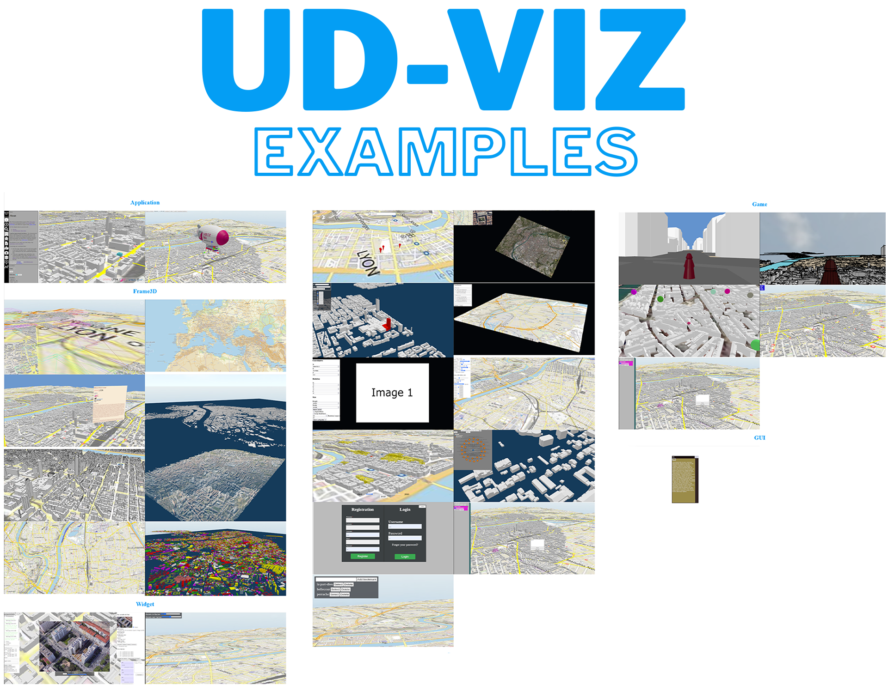
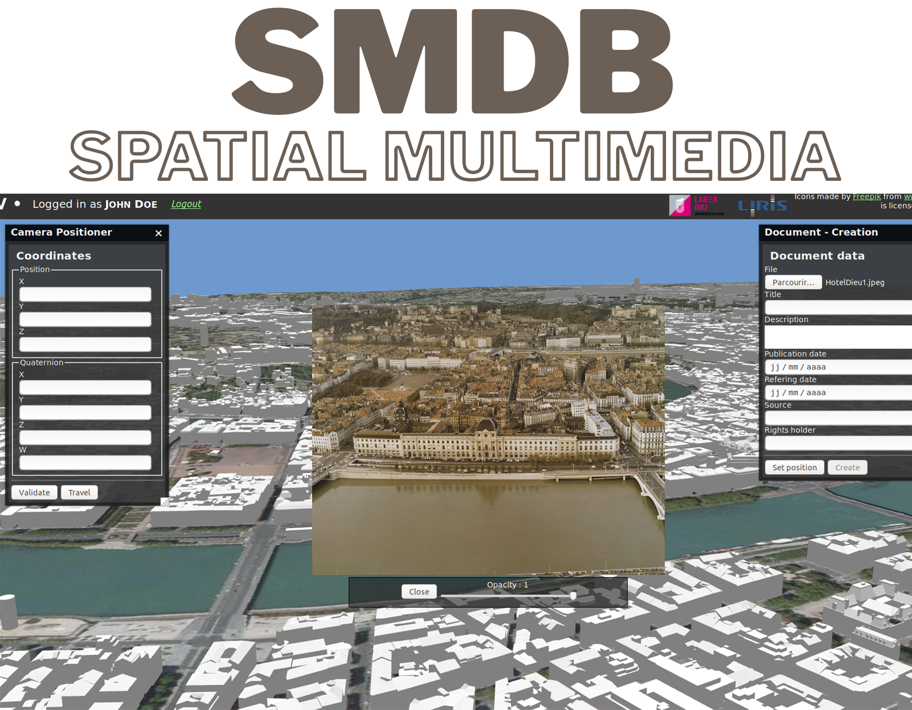
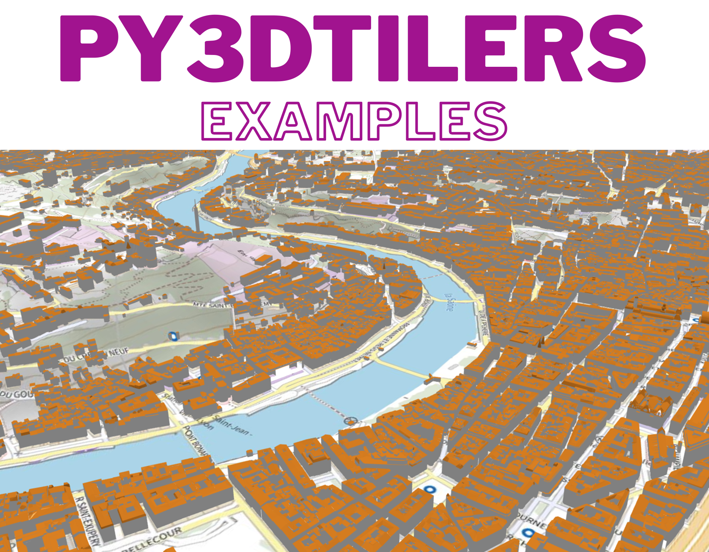
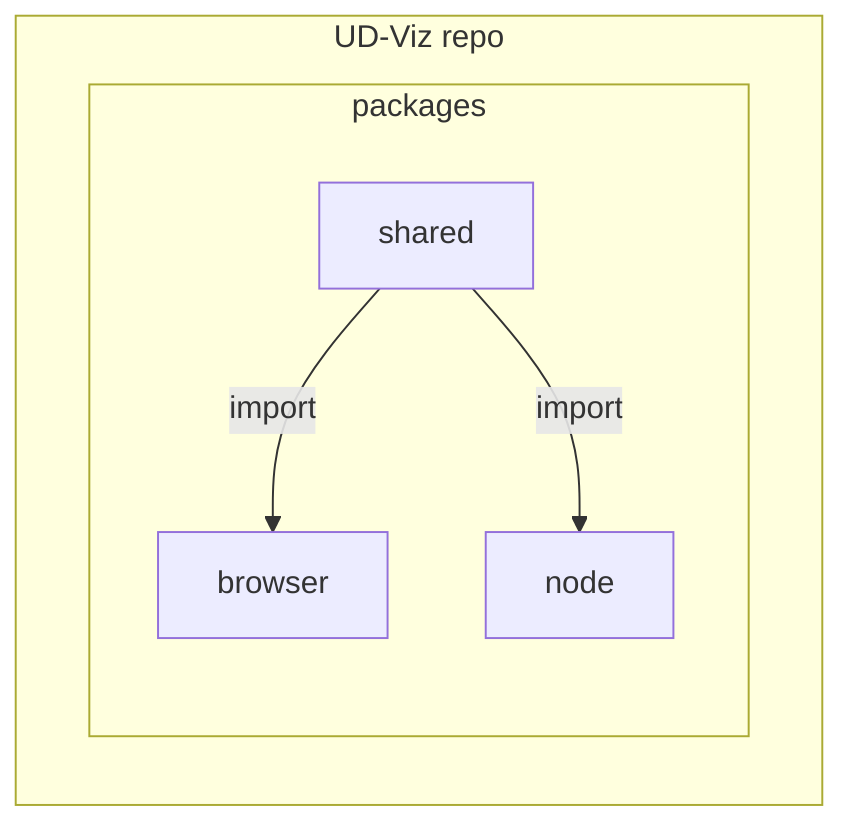

# UD-Viz : Urban Data Vizualisation

[](https://github.com/VCityTeam/UD-Viz/actions/workflows/codeql-analysis.yml)
[](https://app.travis-ci.com/github/VCityTeam/UD-Viz)
[](http://vcityteam.github.io/UD-Viz/html/index.html)

UD-Viz is a javascript mono repository for creating web applications for visualizing and interacting with geospatial 3D urban data.

[Online documentation](https://vcityteam.github.io/UD-Viz/html/index.html) &mdash;
[Developers](./docs/static/Developers.md) &mdash;
[License](./LICENSE.md) &mdash;
[Getting Started](#getting-started) &mdash;
[Architecture](./docs/static/architecture.md)

**Online demos**:

<p>
  <a href="https://ud-viz.vcityliris.data.alpha.grandlyon.com/" ></a>
  <a href="https://www.imuvirtuel.fr/"></a>
  <a href="https://deambulation-bron.vcityliris.data.alpha.grandlyon.com/"></a>
</p>
<p>
  <a href="https://ui-driven-data-lyon.vcityliris.data.alpha.grandlyon.com/" ></a>
  <a href="https://spatial-multimedia-demo.vcityliris.data.alpha.grandlyon.com/"></a>
</p>

_3D tiles related_

<p>
  <a href="https://py3dtilers-demo.vcityliris.data.alpha.grandlyon.com/"></a>
  <a href="https://point-cloud.vcityliris.data.alpha.grandlyon.com/" ></a>
</p>

**UD-Viz Packages:**

Split-code by interpretation environment:

package is interpretable by **Node.js**

- [@ud-viz/game_node](./packages/game_node/Readme.md)
- [@ud-viz/game_node_template](./packages/game_node_template/Readme.md)
- [@ud-viz/utils_node](./packages/utils_node/Readme.md)

package is interpretable by the **browser**

- [@ud-viz/extensions_3d_tiles_temporal](./packages/extensions_3d_tiles_temporal/Readme.md)
- [@ud-viz/frame3d](./packages/frame3d/Readme.md)
- [@ud-viz/game_browser](./packages/game_browser/Readme.md)
- [@ud-viz/game_browser_template](./packages/game_browser_template/Readme.md)
- [@ud-viz/show_room](./packages/show_room/Readme.md)
- [@ud-viz/smdb](./packages/smdb/Readme.md)
- [@ud-viz/utils_browser](./packages/utils_browser/Readme.md)
- [@ud-viz/widget_3d_tiles](./packages/widget_3d_tiles/Readme.md)
- [@ud-viz/widget_base_map](./packages/widget_base_map/Readme.md)
- [@ud-viz/widget_bookmark](./packages/widget_bookmark/Readme.md)
- [@ud-viz/widget_camera_positioner](./packages/widget_camera_positioner/Readme.md)
- [@ud-viz/widget_extensions_3d_tiles_temporal](./packages/widget_extensions_3d_tiles_temporal/Readme.md)
- [@ud-viz/widget_geocoding](./packages/widget_geocoding/Readme.md)
- [@ud-viz/widget_layer_choice](./packages/widget_layer_choice/Readme.md)
- [@ud-viz/widget_planar_controls](./packages/widget_planar_controls/Readme.md)
- [@ud-viz/widget_slide_show](./packages/widget_slide_show/Readme.md)
- [@ud-viz/widget_sparql](./packages/widget_sparql/Readme.md)
- [@ud-viz/widget_workspace](./packages/widget_workspace/Readme.md)

interpretable by **both** environments

- [@ud-viz/game_shared](./packages/game_shared/Readme.md)
- [@ud-viz/game_shared_template](./packages/game_shared_template/Readme.md)
- [@ud-viz/utils_shared](./packages/utils_shared/Readme.md)



### Directory Hierarchy

```
UD-Viz (repo)
├── bin                       # Global NodeJS development and deployment
├── docs                      # Developer and User documentation
├── examples                  # Examples of the ud-viz framework
├── packages                  # Packages folder
|    ├── browser              # UD-Viz Browser-side framework
|    ├── shared               # UD-Viz shared (Browser+Node) framework
|    ├── node                 # UD-Viz Node-side framework
├── .eslintrc.js              # Linting rules and configuration
├── .gitignore                # Files/folders ignored by Git
├── .prettierrc               # Formatting rules
├── travis.yml                # Continuous integration entrypoint
├── favicon.ico               # Landing page icon
├── index.html                # Landing page entrypoint
├── package-lock.json         # Latest npm package installation file
├── package.json              # Global npm project description
├── Readme.md                 # It's a me, Mario!
├── style.css                 # Landing page style
```

**Github repositories:**

| Repository      | Link                                         | Description                                                                            |
| --------------- | -------------------------------------------- | -------------------------------------------------------------------------------------- |
| UD-Viz-docker   | https://github.com/VCityTeam/UD-Viz-docker   | Docker, which performs all the steps described in [Getting Started](#getting-started). |
| UD-Viz-template | https://github.com/VCityTeam/UD-Viz-template | A basis for creating your application using UD-Viz.                                    |

## Getting Started

### Installing node/npm

For the node/npm installation instructions refer [here](https://github.com/VCityTeam/UD-SV/blob/master/Tools/ToolNpm.md)

UD-Viz has been reported to work with versions:

- node version 18.X
- npm version: 9.X

### Installing the UD-Viz framework per se

Clone the UD-Viz repository and install requirements with npm

```bash
git clone https://github.com/VCityTeam/UD-Viz.git
cd UD-Viz
npm install # resolve dependencies based on the package.json (and package-lock.json if it exists)
```

### How to run it locally?

```bash
npm run start
```

After running go to [localhost:8000](http://localhost:8000) which links to [documentation](./docs/) and [examples](./examples/)
