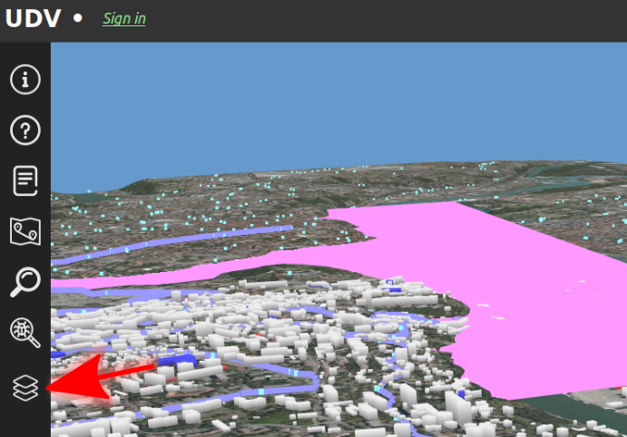
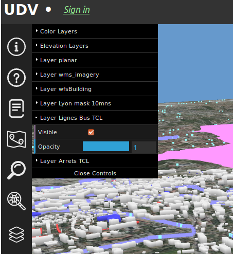

# Details on UDV-Core modifications

## Functions to create vectors layers (*points, lines, polygons, ...*) in iTowns from a JSON configuration file in order to simplify the process
### Summary

| Issue | State | iTowns issues |
|:------|:------|:--------------|
| Add and configure vectors layers (*lines, polygons, points*) only from JSON file in order to avoid modifications in JavaScript and simplify the process | Working, bug on ```linewidth``` and multipolygons | https://github.com/iTowns/itowns/issues/1182 https://github.com/iTowns/itowns/issues/1179 |

### Modified files and linked files
| Files | Type | Directory (*relative to UDV-Core directory*) | Status |
|:------|:-----|:--------------------------------------------:|-------:|
| BaseDemo.js | JS | */src/Utils/BaseDemo/js/* | ***Required*** |
| layers_settings.json | JSON | */examples/MAM/data/config/* | ***Required*** |
| mini_poly.geojson | GeoJSON | */examples/MAM/data/geojson/* | ***Optional*** |

### Configuration JSON file
#### Presentation and examples

The JSON configuration file is a list of JSON object structured like this:
* for ***WFS*** source (*example below*):
  ```JSON
  {
    "id": "Lignes Bus TCL",
    "geometry": "lines",
    "linewidth": 50,
    "source": {
      "url": "https://download.data.grandlyon.com/wfs/rdata?",
      "protocol": "wfs",
      "version": "2.0.0",
      "typeName": "tcl_sytral.tcllignebus",
      "projection": "EPSG:3946",
      "zoom": {
        "min": 2,
        "max": 2
      },
      "format": "geojson"
    },
    "color": {
      "red": 0.6,
      "green": 0.6,
      "blue": 1.0
    }
  }
  ```
* for ***File*** source (*example below*):
  ```JSON
  {
    "id": "Lyon mask 10mns",
    "geometry": "polygons",
    "source": {
      "format": "geojson",
      "url": "http://localhost:8080/examples/MAM/data/geojson/mini_poly.geojson",
      "projection": "EPSG:3946",
      "zoom": {
        "min": 2,
        "max": 2
      }
    },
    "color": {
      "red": 1.0,
      "green": 0.6,
      "blue": 1.0
    }
  }
  ```

Let see some of the main parameters in details.

#### Parameters in details

We use parameters allowed by iTowns tools. We added some parameters (*geometry, color, ...*) to facilitate the management.

* ```id```(**str**): *unique id/title for the layer*
* ```geometry```(**str**): *possible values for the geometry*:
  * lines,
  * polygons,
  * points
* ```size```(**str**): *ONLY FOR POINTS [OPTIONAL], size of points*
* ```linewidth```(**str**): *ONLY FOR LINES [OPTIONAL], width of lines*
* ```source```(**json object**): *source of the data*:
  * ```format```(**str**): *format of the source, ex: "geojson"*,
  * ```url```(**str**): *url of the "local" source*,
  * ```protocol```(**str**): *protocol to use, **must be deleted for file source**. Ex: "wfs"*,
  * ```projection```(**str**): *EPSG of the source, ex: "EPSG:4326"*,
  * ```zoom```(**json object**): *range of zoom*:
    * ```min```(**int**): *zoom minimum*,
    * ```max```(**int**): *zoom maximum*
* ```color```(**json object**): *color of the elements*:
  * ```red```(**float**): *proportion of red, from 0.0 to 1.0*
  * ```green```(**float**): *proportion of green, from 0.0 to 1.0*
  * ```blue```(**float**): *proportion of blue, from 0.0 to 1.0*

This list of parameters will be read by JavaScript functions.

### JavaScript functions
#### Set specific variables

First, we had to set specific variables (*altitude and color*) in order to simplify the process:

```JavaScript
let color = new itowns.THREE.Color();
    let rgb;

    // ********* Function to set altitude relative to tile altitude
    var altitude = (properties, contour) => {
      var result;
      var z = 0;
      if (contour) {
        result = itowns.DEMUtils.getElevationValueAt(this.view.tileLayer, contour, 0, tile);

        if (!result) {
          result = itowns.DEMUtils.getElevationValueAt(this.view.tileLayer, contour, 0);
        }
        tile = [result.tile];
        if (result) {
          z = result.z;
        }
        return z + 10;
      }
    };

    // ********* Set the absolute value for polygons layer altitude
    var altitudePoly = 200;
```

The altitude of polygons layers is set with the altitudePoly variable (*an integer*) for the moment. But this must be improved in order to manage altitude regarding the tile as in the lines/points case (*with the altitude function*).

Then we can parse the configuration JSON file and loop through all the JSON objects in the list.

#### Parse the JSON configuration file and loop through JSON objects

* Get the ```geometry```, the ```protocol``` (*if any*), and set global variables (```config```, ```size```, ```linewidth```)

```JavaScript
itowns.Fetcher.json('../../../examples/MAM/data/config/layers_settings.json')
      .then(
        (configList) => {
          for (var i in configList) {
            let geometry = configList[i].geometry;
            let protocol = configList[i].source.protocol;
            let config;
            let size;
            let linewidth;
```

* Set the parameters (*default if undefined in the parameters file*) for each case within a unique function:
  * points,
  * polygons,
  * lines (***WARNING: linewidth doesn't work for now***)

```JavaScript
let addGeometryLayerFromConfig = (config) => {
  if (geometry === "polygons"){
    config.altitude = altitudePoly
  }
  else if (geometry === "lines"){
    config.altitude = altitude;
    if (config.linewidth){
      linewidth = config.linewidth
    }
    else {
      linewidth = 50
    };
    config.onMeshCreated = function(result) {
      result.traverse(function _setLineWidth(mesh) {
        if (mesh.material) {
          mesh.material.linewidth = linewidth;
        }
      });
    }
  }
  else if (geometry === "points"){
    config.altitude = altitude;
    if (config.size){
      size = config.size
    }
    else {
      size = 50
    };
    config.onMeshCreated = function(result) {
      result.traverse(function _setPointSize(mesh) {
        if (mesh.material) {
          mesh.material.size = size;
        }
      });
    }
  };
  config.update = itowns.FeatureProcessing.update;
  config.convert = itowns.Feature2Mesh.convert({
    color: new itowns.THREE.Color().setRGB(
      config.color.red,
      config.color.green,
      config.color.blue
    ),
    altitude: config.altitude,
  });
  config.overrideAltitudeInToZero = true;
  config.projection = config.source.projection;
  config.source = config.source;
  let layer = new itowns.GeometryLayer(
    config.id,
    new itowns.THREE.Group(),
    config
  );
  return this.view.addLayer(layer);
};
```

* Set the ```configuration.source``` regarding the ```protocol```:

```JavaScript
if (protocol === undefined) {
  let configuration = configList[i];
  var promise = new Promise(
    function(resolve, reject) {
      configuration.source = new itowns.FileSource(configList[i].source);
      resolve(configuration);
    }
  );
  promise.then(addGeometryLayerFromConfig);
}

//// If protocol === "wfs", set configuration
else if (protocol === "wfs") {
  let configuration = configList[i];
  var promise = new Promise(
    function(resolve, reject) {
      configuration.source = new itowns.WFSSource(configList[i].source);
      resolve(configuration);
    }
  );
  promise.then(addGeometryLayerFromConfig);
}
```

### Complete source code for these functions

```JavaScript
// ********* COLOR AND ALTITUDE BASIC SETTINGS
    let color = new itowns.THREE.Color();
    let rgb;

    // ********* Function to set altitude relative to tile altitude
    var altitude = (properties, contour) => {
      var result;
      var z = 0;
      if (contour) {
        result = itowns.DEMUtils.getElevationValueAt(this.view.tileLayer, contour, 0, tile);

        if (!result) {
          result = itowns.DEMUtils.getElevationValueAt(this.view.tileLayer, contour, 0);
        }
        tile = [result.tile];
        if (result) {
          z = result.z;
        }
        return z + 10;
      }
    };

    // ********* Set the absolute value for polygons layer altitude
    var altitudePoly = 200;

    // ********* Function to get color for lines
    var colorLine = function(properties) {
      if (properties) {
        var rgb = properties.couleur.split(' ');
        return color.setRGB(rgb[0] / 255, rgb[1] / 255, rgb[2] / 255);
      } else {
        return color.setRGB(1, 1, 1);
      }
    };


    //******** FUNCTIONS TO CREATE LAYERS FROM CONFIG JSON FILE
    itowns.Fetcher.json('../../../examples/MAM/data/config/layers_settings.json')
      .then(
        (configList) => {
          for (var i in configList) {
            let geometry = configList[i].geometry;
            let protocol = configList[i].source.protocol;
            let config;
            let size;
            let linewidth;

            let addGeometryLayerFromConfig = (config) => {
              if (geometry === "polygons"){
                config.altitude = altitudePoly
              }
              else if (geometry === "lines"){
                config.altitude = altitude;
                if (config.linewidth){
                  linewidth = config.linewidth
                }
                else {
                  linewidth = 50 //default
                };
                config.onMeshCreated = function(result) {
                  result.traverse(function _setLineWidth(mesh) {
                    if (mesh.material) {
                      mesh.material.linewidth = linewidth;
                    }
                  });
                }
              }
              else if (geometry === "points"){
                config.altitude = altitude;
                if (config.size){
                  size = config.size
                }
                else {
                  size = 50 //default
                };
                config.onMeshCreated = function(result) {
                  result.traverse(function _setPointSize(mesh) {
                    if (mesh.material) {
                      mesh.material.size = size;
                    }
                  });
                }
              };
              config.update = itowns.FeatureProcessing.update;
              config.convert = itowns.Feature2Mesh.convert({
                color: new itowns.THREE.Color().setRGB(
                  config.color.red,
                  config.color.green,
                  config.color.blue
                ),
                altitude: config.altitude,
              });
              config.overrideAltitudeInToZero = true;
              config.projection = config.source.projection;
              config.source = config.source;
              let layer = new itowns.GeometryLayer(
                config.id,
                new itowns.THREE.Group(),
                config
              );
              return this.view.addLayer(layer);
            };

            //// If no protocol, set configuration
            if (protocol === undefined) {
              let configuration = configList[i];
              var promise = new Promise(
                function(resolve, reject) {
                  configuration.source = new itowns.FileSource(configList[i].source);
                  resolve(configuration);
                }
              );
              promise.then(addGeometryLayerFromConfig);
            }

            //// If protocol === "wfs", set configuration
            else if (protocol === "wfs") {
              let configuration = configList[i];
              var promise = new Promise(
                function(resolve, reject) {
                  configuration.source = new itowns.WFSSource(configList[i].source);
                  resolve(configuration);
                }
              );
              promise.then(addGeometryLayerFromConfig);
            }
          }
        }
      );
```

## Add a layer management tool
### Summary

| Issue | State | iTowns issues |
|:------|:-----:| :-------------|
| Allow to manage layers (*visible, hidden, opacity*) through a graphical interface | Working | https://github.com/iTowns/itowns/issues/1178 |

### Modified files and linked files

| Files | Type | Directory (*relative to UDV-Core directory*) | Status |
|:------|:-----|:--------------------------------------------:|-------:|
| LayerControl.js | JS | */src/Extensions/LayerControls/* | ***Required*** |
| debug.js | JS | */src/Extensions/LayerControls/* | ***Required*** |
| GuiTools.js | JS | */src/Extensions/LayerControls/* | ***Required*** |
| dat.gui.min.js | JS | */src/Extensions/LayerControls/dat.gui/* | ***Required*** |
| Demo.js | JS | */examples/MAM/* | ***Example*** |
| Demo.html | HTML | */examples/MAM/* | ***Example*** |
| example.css | CSS | */examples/MAM/* | ***Required*** |
| Demo.css | CSS | */src/Utils/BaseDemo/css/* | ***Required*** |
| moment.js | JS | */node_modules/moment/* | ***Required*** |
| udvcore.js | JS | */dist/* | ***Required*** |
| three.js | JS | */node_modules/three/build/* | ***Required*** |
| itowns.js| JS | */node_modules/itowns/dist/* | ***Required*** |
| BaseDemo.js | JS | */src/Utils/BaseDemo/js/* | ***Required*** |
| ModuleView.js | JS | */Utils/ModuleView/* | ***Required*** |

### Explanations

As explained in the [iTowns issue](https://github.com/iTowns/itowns/issues/1178), there are iTowns examples about layers Menu creation but no documentation (*however we base our ```LayerControl``` extension on iTowns examples*).

The creation is not really easy but we managed to add a ```LayerControl``` extension, based on the other extensions templates:

```JavaScript
import { ModuleView } from '../../Utils/ModuleView/ModuleView'; //relative path if we're in a src/Category/ModuleName folder
import { GuiTools } from './GuiTools.js'

export class LayerControls extends ModuleView {
    constructor(view, itowns) {
        super() // calling super() is mandatory for subclasses
        this.view = view;
        this.itowns = itowns
    }

    // How to display the view ?
    enableView() {
        this.menuGlobe = new GuiTools('menuDiv', this.view, document.getElementById('viewerDiv'), this.itowns); //calls a method that creates the DOM elements
         for (var layer of this.view.getLayers()) {

                 layer.whenReady.then(  (layer) => {
                   if (layer.visible != undefined)
                   {
                     var gui = debug.GeometryDebug.createGeometryDebugUI(this.menuGlobe.gui, this.view, layer);
                  }
                 });
             }
          }

    // How to close the view ?
    disableView() {
        if (this.menuGlobe !== undefined)
          {
            this.menuGlobe.gui.destroy()
          }; //This methods destroys the DOM elements
    }
}
```

To add this extension, just add this in the main JS file:
```JavaScript
/////// LAYERS CONTROLS
  const layercontrols = new udvcore.LayerControls(baseDemo.view, baseDemo.itowns);
  baseDemo.addModuleView('LayerControls', layercontrols);
```

This extension is based on ```GuiTools.js``` and ```ModuleView```.

* User can click on the Layer Controls button (*see image below*)


* Then layers can be controlled through the menu that appears:
  * visibility (*Visible checkbox*)
  * opacity (*slider*)

