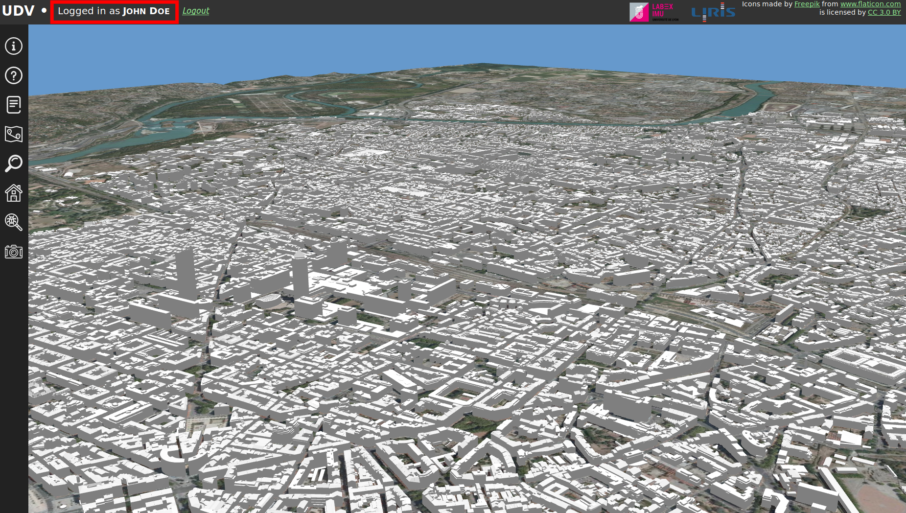

# Contribute to the project with new data

UDV is developed in the context of the [VCity research project](https://projet.liris.cnrs.fr/vcity/wiki/doku.php). 
One aspect of this project is to enhance numerical representations of cities
 with documents in order to highlight and share cultural heritage and
 to understand urban evolution.
 
You can help us achieving these goals by contributing data such as historical
 documents, pictures, maps, text, etc.
 
 **Where ?** [Follow this link...](http://rict.liris.cnrs.fr/UDVDemo/UDV/UDV-Core/examples/DemoStable/Demo.html)
 
This tutorial describes step by step how you can contribute and what kind of
 contributions are possible.

## Creating an account

Before starting contributing, you need to open an account. To do so, you must
click on the *Sign in* button on the upper-left corner of 
[the application](http://rict.liris.cnrs.fr/UDVDemo/UDV/UDV-Core/examples/DemoStable/Demo.html):

Once you've clicked the *Sing in* button, fill the *Registration form* and
click *Register*:

You're account is now created! 

You can now log in with the *Login* form on the right. If this was successful, 
you should see your name on the upper-left corner of the application instead
of the previous *Sign in*:

**Note**: Your account gives you **contributor** rights, meaning that
when you [add a document](#adding-a-document) it is not right away published. 
It is indeed first verified by an **administrator** to check that there is no
insanity nor problems in filled attributes (see [Document validation 
process](#document-validation-process) for more information).
  
## Adding a document

One way of contributing is by adding documents. For the time being, documents
are images (jpeg or png). 

You can see existing documents by opening the **Document** module from the
left side menu:

Clicking on this menu opens the **Document Navigator** and the **Document
Inspector**. These two windows allow to consult the existing documentation:

TODO: capture d'écran de doc navigator et inspector et carré sur chaque zone
 avec flèche qui décrit ce que ça permet de faire.

## Document validation process 

