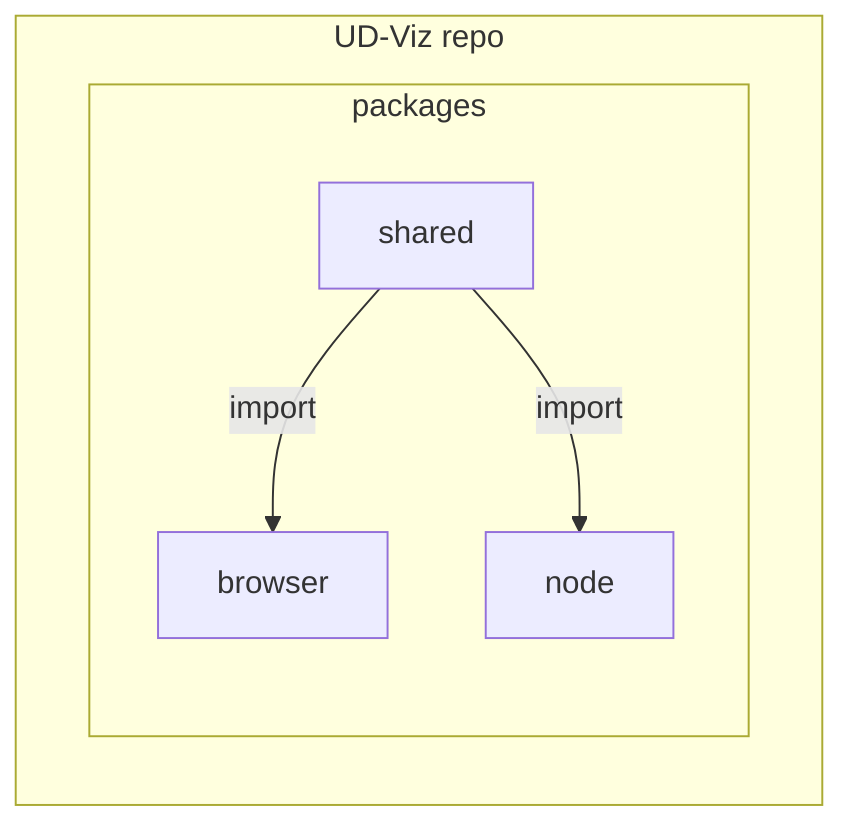
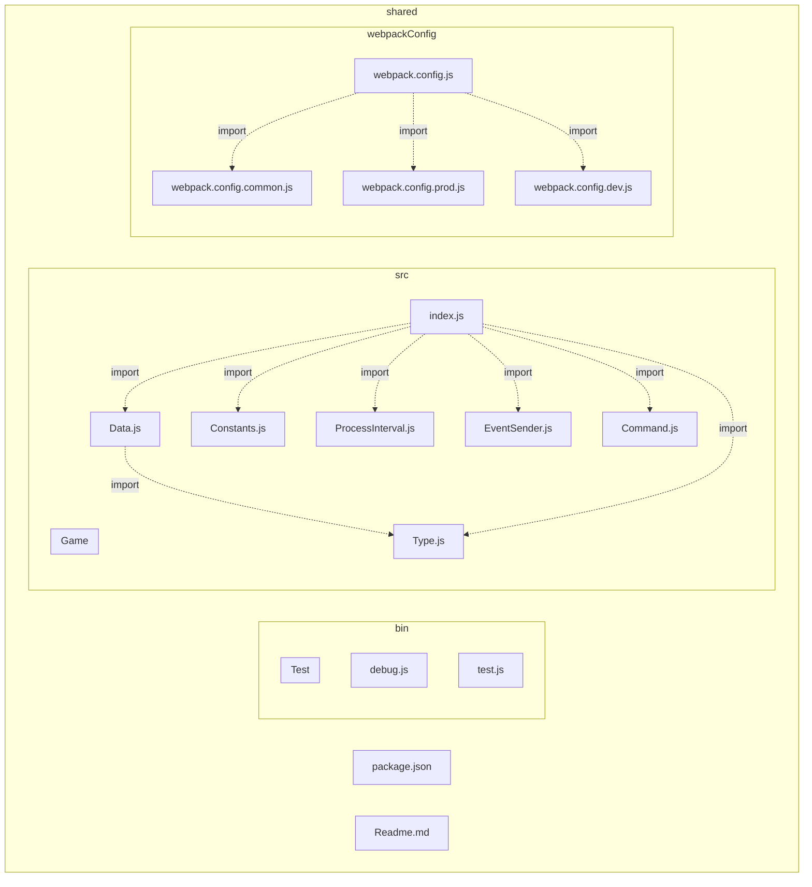
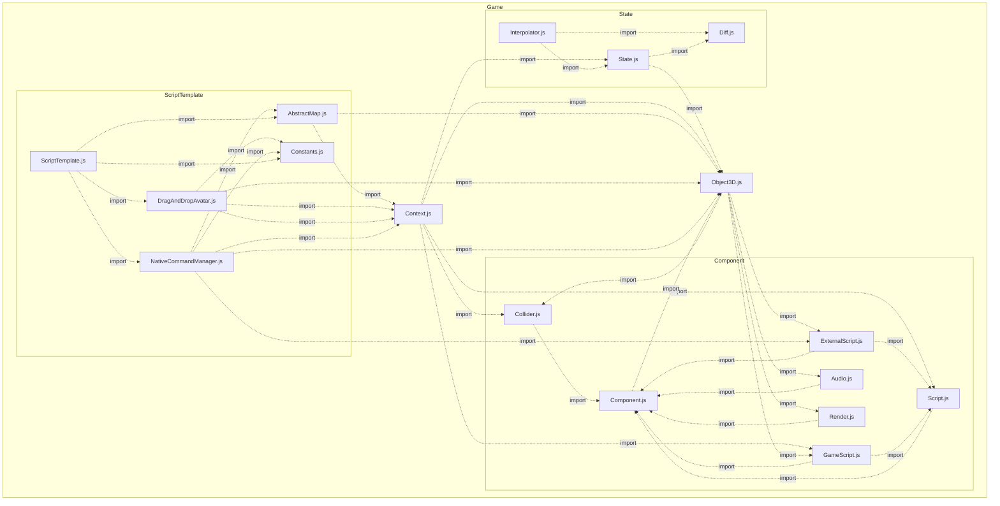
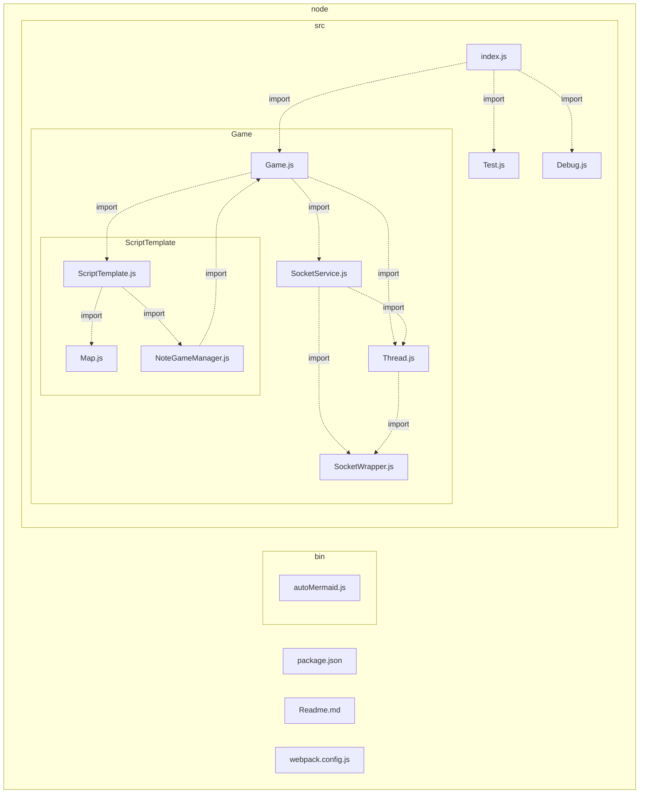
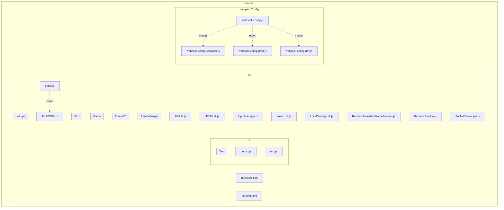
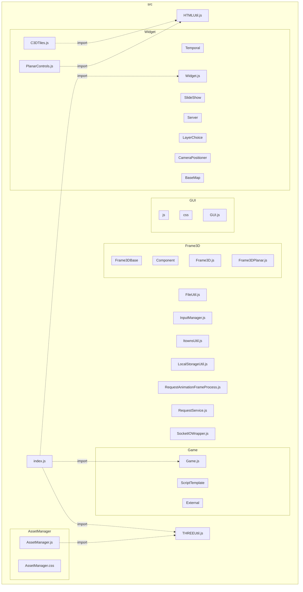
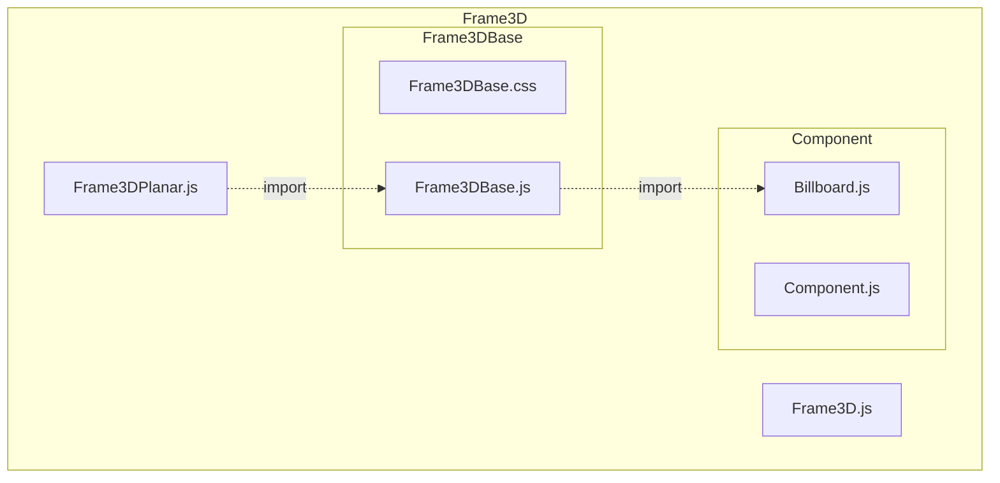
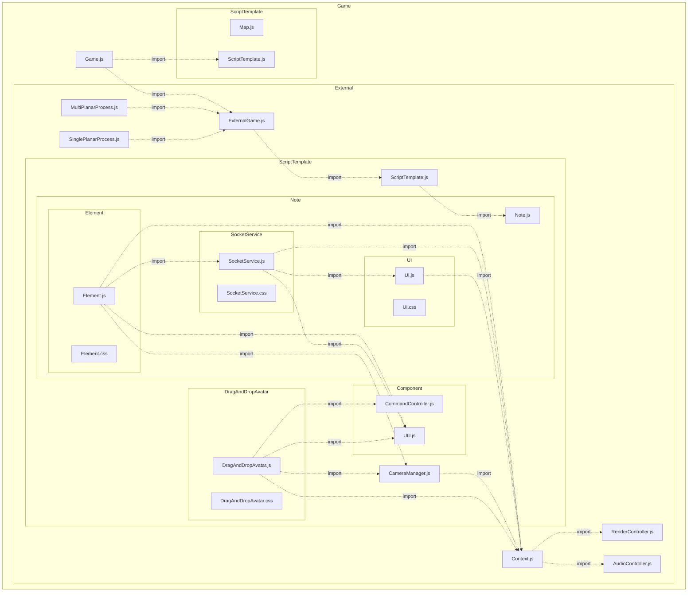
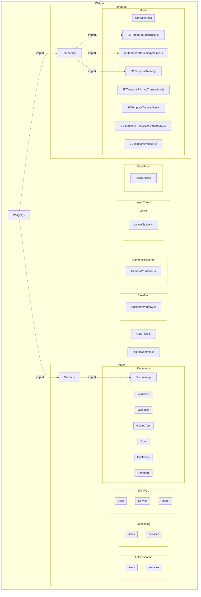

# Architecture

## Monorepo 

Ud-Viz is a 3-package JavaScript framework. The source code is organized in a [monorepo](https://monorepo.tools/) structure.

Split-code by interpretation environment:  
- [@ud-viz/browser](../../packages/browser/Readme.md) package is interpretable by the browser
- [@ud-viz/node](../../packages/node/Readme.md) package is interpretable by Node.js
- [@ud-viz/shared](../../packages/shared/Readme.md) interpretable by both environments

Why? 
- No overhead to create new projects 
- One version of everything 
- Atomic commits across projects
- Developer mobility

> See: https://monorepo.tools/#why-a-monorepo

## Shared package

**Global diagram (deep 2)**

**shared/src/Game**

## Node package

**Node diagram**

## Browser

**Browser diagram (deep 2)**

**Browser src (deep 2)**

**Browser src/Frame3D/**

**Browser src/Game**

**Browser src/Widget (deep 3)**

