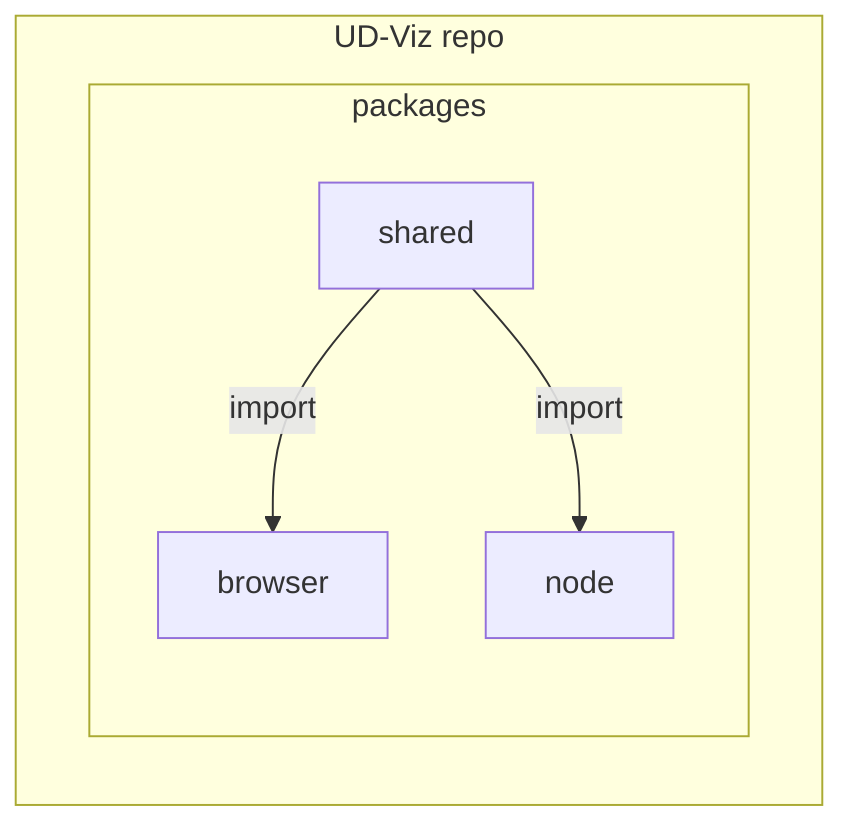

# Architecture

## Monorepo 

Ud-Viz is a 3-package JavaScript framework. The source code is organized in a [monorepo](https://monorepo.tools/) structure.

Split-code by interpretation environment:  
- [@ud-viz/browser](../../packages/browser/Readme.md) package is interpretable by the browser
- [@ud-viz/node](../../packages/node/Readme.md) package is interpretable by Node.js
- [@ud-viz/shared](../../packages/shared/Readme.md) interpretable by both environments

Why? 
- No overhead to create new projects 
- One version of everything 
- Atomic commits across projects
- Developer mobility

> See: https://monorepo.tools/#why-a-monorepo

## Shared package

[**Shared diagram (deep 3)**](./diagram/shared/SharedD3.md)

[**Shared Game**](./diagram/shared/SharedSrcGame.md)

## Node package

[**Node diagram**](./diagram/node/Node.md)
## Browser

[**Browser diagram (deep 2)**](./diagram/browser/BrowserD2.md)

[**Browser src (deep 2)**](./diagram/browser/BrowserSrcD2.md)

[**Browser src/Frame3D/**](./diagram/browser/BrowserSrcFrame3D.md)

[**Browser src/Game (deep 3)**](./diagram/browser/BrowserSrcGameD3.md)

[**Browser src/Widget (deep 3)**](./diagram/browser/BrowserSrcWidgetD3.md)

