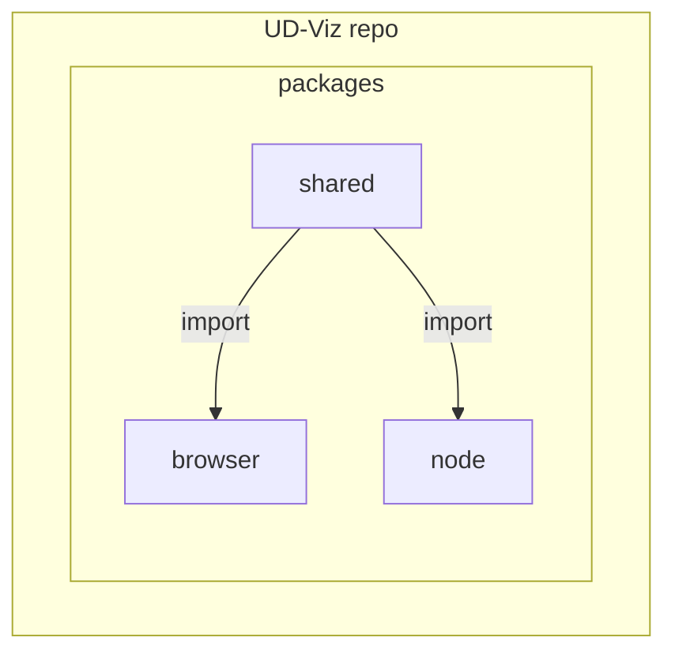

# Architecture

## Monorepo 

Ud-Viz is a 3-package JavaScript framework. The source code is organized in a [monorepo](https://monorepo.tools/) structure.

Split-code by interpretation environment:  
- [@ud-viz/browser](./packages/browser) package is interpretable by the browser
- [@ud-viz/node](./packages/node) package is interpretable by Node.js
- [@ud-viz/shared](./packages/shared) interpretable by both environments

> Why ? See: https://monorepo.tools/#why-a-monorepo
- No overhead to create new projects 
- One version of everything 
- Atomic commits across projects
- Developer mobility