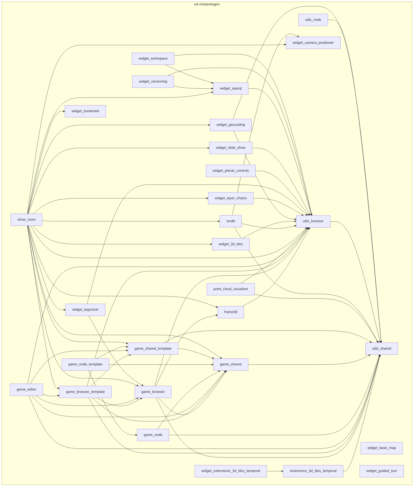

# @ud-viz packages architecture

```mermaid
flowchart TB
subgraph ud-viz/packages
extensions_3d_tiles_temporal
frame3d
game_browser
game_browser_template
game_editor
game_node
game_node_template
game_shared
game_shared_template
point_cloud_visualizer
show_room
smdb
utils_browser
utils_node
utils_shared
widget_3d_tiles
widget_base_map
widget_bookmark
widget_camera_positioner
widget_extensions_3d_tiles_temporal
widget_geocoding
widget_guided_tour
widget_layer_choice
widget_legonizer
widget_planar_controls
widget_slide_show
widget_sparql
widget_versioning
widget_workspace
end
extensions_3d_tiles_temporal-->utils_shared
frame3d-->utils_browser
game_browser-->frame3d
game_browser-->game_shared
game_browser-->utils_browser
game_browser-->utils_shared
game_browser_template-->game_browser
game_browser_template-->game_shared
game_browser_template-->game_shared_template
game_browser_template-->utils_browser
game_browser_template-->utils_shared
game_editor-->game_shared
game_editor-->game_shared_template
game_editor-->game_browser
game_editor-->game_browser_template
game_editor-->utils_browser
game_editor-->utils_shared
game_node-->game_shared
game_node-->utils_shared
game_node_template-->game_node
game_node_template-->game_shared
game_node_template-->game_shared_template
game_shared-->utils_shared
game_shared_template-->game_shared
game_shared_template-->utils_shared
point_cloud_visualizer-->utils_browser
point_cloud_visualizer-->utils_shared
show_room-->frame3d
show_room-->smdb
show_room-->utils_browser
show_room-->widget_camera_positioner
show_room-->widget_geocoding
show_room-->widget_layer_choice
show_room-->widget_slide_show
show_room-->widget_sparql
show_room-->widget_3d_tiles
show_room-->widget_bookmark
show_room-->game_browser
show_room-->game_browser_template
show_room-->game_shared
show_room-->game_shared_template
show_room-->widget_legonizer
smdb-->utils_browser
smdb-->utils_shared
smdb-->widget_camera_positioner
utils_browser-->utils_shared
utils_node-->utils_shared
widget_3d_tiles-->utils_browser
widget_extensions_3d_tiles_temporal-->extensions_3d_tiles_temporal
widget_geocoding-->utils_browser
widget_geocoding-->utils_shared
widget_layer_choice-->utils_browser
widget_legonizer-->game_browser
widget_legonizer-->utils_browser
widget_planar_controls-->utils_browser
widget_slide_show-->utils_browser
widget_sparql-->utils_browser
widget_versioning-->utils_browser
widget_versioning-->widget_sparql
widget_workspace-->utils_browser
widget_workspace-->widget_sparql
```
>This file is auto generated