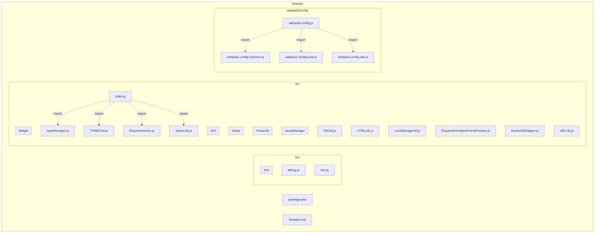

```mermaid
flowchart
 subgraph IDbrowser["browser"]
  IDbrowserPackagejson["package.json"]
  IDbrowserReadmemd["Readme.md"]
  subgraph IDbrowserBin["bin"]
   IDbrowserBinDebugjs["debug.js"]
   IDbrowserBinTestjs["test.js"]
   subgraph IDbrowserBinTest["Test"]
   end
  end
  subgraph IDbrowserSrc["src"]
   IDbrowserSrcFileUtiljs["FileUtil.js"]
   IDbrowserSrcHTMLUtiljs["HTMLUtil.js"]
   IDbrowserSrcIndexjs["index.js"]
   IDbrowserSrcInputManagerjs["InputManager.js"]
   IDbrowserSrcItownsUtiljs["ItownsUtil.js"]
   IDbrowserSrcLocalStorageUtiljs["LocalStorageUtil.js"]
   IDbrowserSrcRequestAnimationFrameProcessjs["RequestAnimationFrameProcess.js"]
   IDbrowserSrcRequestServicejs["RequestService.js"]
   IDbrowserSrcSocketIOWrapperjs["SocketIOWrapper.js"]
   IDbrowserSrcTHREEUtiljs["THREEUtil.js"]
   IDbrowserSrcURLUtiljs["URLUtil.js"]
   subgraph IDbrowserSrcAssetManager["AssetManager"]
   end
   subgraph IDbrowserSrcFrame3D["Frame3D"]
   end
   subgraph IDbrowserSrcGame["Game"]
   end
   subgraph IDbrowserSrcGUI["GUI"]
   end
   subgraph IDbrowserSrcWidget["Widget"]
   end
  end
  subgraph IDbrowserWebpackConfig["webpackConfig"]
   IDbrowserWebpackConfigWebpackconfigcommonjs["webpack.config.common.js"]
   IDbrowserWebpackConfigWebpackconfigdevjs["webpack.config.dev.js"]
   IDbrowserWebpackConfigWebpackconfigjs["webpack.config.js"]
   IDbrowserWebpackConfigWebpackconfigprodjs["webpack.config.prod.js"]
  end
 end
IDbrowserSrcIndexjs-.->|import|IDbrowserSrcInputManagerjs
IDbrowserSrcIndexjs-.->|import|IDbrowserSrcTHREEUtiljs
IDbrowserSrcIndexjs-.->|import|IDbrowserSrcRequestServicejs
IDbrowserSrcIndexjs-.->|import|IDbrowserSrcItownsUtiljs
IDbrowserWebpackConfigWebpackconfigjs-.->|import|IDbrowserWebpackConfigWebpackconfigprodjs
IDbrowserWebpackConfigWebpackconfigjs-.->|import|IDbrowserWebpackConfigWebpackconfigdevjs
IDbrowserWebpackConfigWebpackconfigjs-.->|import|IDbrowserWebpackConfigWebpackconfigcommonjs
```