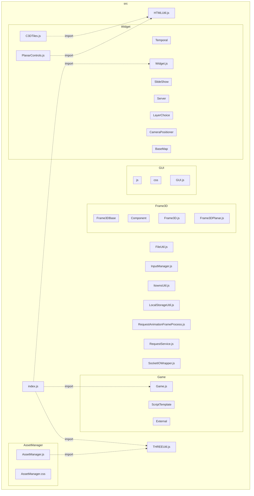

```mermaid
flowchart
 subgraph IDsrc["src"]
  IDsrcFileUtiljs["FileUtil.js"]
  IDsrcHTMLUtiljs["HTMLUtil.js"]
  IDsrcIndexjs["index.js"]
  IDsrcInputManagerjs["InputManager.js"]
  IDsrcItownsUtiljs["ItownsUtil.js"]
  IDsrcLocalStorageUtiljs["LocalStorageUtil.js"]
  IDsrcRequestAnimationFrameProcessjs["RequestAnimationFrameProcess.js"]
  IDsrcRequestServicejs["RequestService.js"]
  IDsrcSocketIOWrapperjs["SocketIOWrapper.js"]
  IDsrcTHREEUtiljs["THREEUtil.js"]
  subgraph IDsrcAssetManager["AssetManager"]
   IDsrcAssetManagerAssetManagercss["AssetManager.css"]
   IDsrcAssetManagerAssetManagerjs["AssetManager.js"]
  end
  subgraph IDsrcFrame3D["Frame3D"]
   IDsrcFrame3DFrame3Djs["Frame3D.js"]
   IDsrcFrame3DFrame3DPlanarjs["Frame3DPlanar.js"]
   subgraph IDsrcFrame3DComponent["Component"]
   end
   subgraph IDsrcFrame3DFrame3DBase["Frame3DBase"]
   end
  end
  subgraph IDsrcGame["Game"]
   IDsrcGameGamejs["Game.js"]
   subgraph IDsrcGameExternal["External"]
   end
   subgraph IDsrcGameScriptTemplate["ScriptTemplate"]
   end
  end
  subgraph IDsrcGUI["GUI"]
   IDsrcGUIGUIjs["GUI.js"]
   subgraph IDsrcGUICss["css"]
   end
   subgraph IDsrcGUIJs["js"]
   end
  end
  subgraph IDsrcWidget["Widget"]
   IDsrcWidgetC3DTilesjs["C3DTiles.js"]
   IDsrcWidgetPlanarControlsjs["PlanarControls.js"]
   IDsrcWidgetWidgetjs["Widget.js"]
   subgraph IDsrcWidgetBaseMap["BaseMap"]
   end
   subgraph IDsrcWidgetCameraPositioner["CameraPositioner"]
   end
   subgraph IDsrcWidgetLayerChoice["LayerChoice"]
   end
   subgraph IDsrcWidgetServer["Server"]
   end
   subgraph IDsrcWidgetSlideShow["SlideShow"]
   end
   subgraph IDsrcWidgetTemporal["Temporal"]
   end
  end
 end
IDsrcIndexjs-.->|import|IDsrcTHREEUtiljs
IDsrcIndexjs-.->|import|IDsrcGameGamejs
IDsrcIndexjs-.->|import|IDsrcWidgetWidgetjs
IDsrcAssetManagerAssetManagerjs-.->|import|IDsrcTHREEUtiljs
IDsrcWidgetC3DTilesjs-.->|import|IDsrcHTMLUtiljs
IDsrcWidgetPlanarControlsjs-.->|import|IDsrcHTMLUtiljs
```