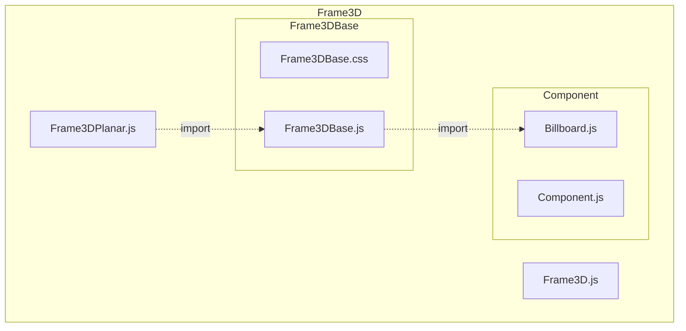

```mermaid
flowchart
 subgraph IDFrame3D["Frame3D"]
  IDFrame3DFrame3Djs["Frame3D.js"]
  IDFrame3DFrame3DPlanarjs["Frame3DPlanar.js"]
  subgraph IDFrame3DComponent["Component"]
   IDFrame3DComponentBillboardjs["Billboard.js"]
   IDFrame3DComponentComponentjs["Component.js"]
  end
  subgraph IDFrame3DFrame3DBase["Frame3DBase"]
   IDFrame3DFrame3DBaseFrame3DBasecss["Frame3DBase.css"]
   IDFrame3DFrame3DBaseFrame3DBasejs["Frame3DBase.js"]
  end
 end
IDFrame3DFrame3DPlanarjs-.->|import|IDFrame3DFrame3DBaseFrame3DBasejs
IDFrame3DFrame3DBaseFrame3DBasejs-.->|import|IDFrame3DComponentBillboardjs
```