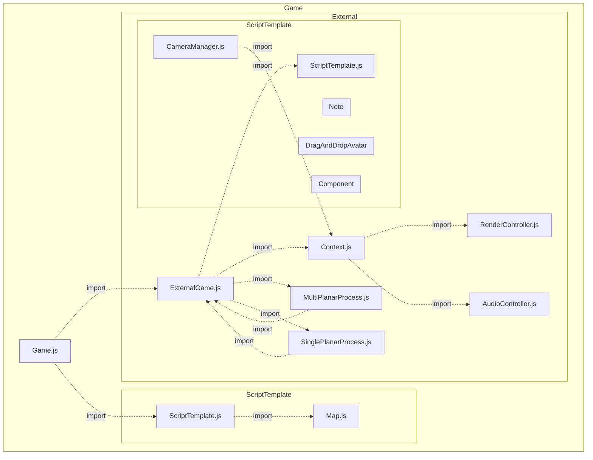

```mermaid
flowchart
 subgraph IDGame["Game"]
  IDGameGamejs["Game.js"]
  subgraph IDGameExternal["External"]
   IDGameExternalAudioControllerjs["AudioController.js"]
   IDGameExternalContextjs["Context.js"]
   IDGameExternalExternalGamejs["ExternalGame.js"]
   IDGameExternalMultiPlanarProcessjs["MultiPlanarProcess.js"]
   IDGameExternalRenderControllerjs["RenderController.js"]
   IDGameExternalSinglePlanarProcessjs["SinglePlanarProcess.js"]
   subgraph IDGameExternalScriptTemplate["ScriptTemplate"]
    IDGameExternalScriptTemplateCameraManagerjs["CameraManager.js"]
    IDGameExternalScriptTemplateScriptTemplatejs["ScriptTemplate.js"]
    subgraph IDGameExternalScriptTemplateComponent["Component"]
    end
    subgraph IDGameExternalScriptTemplateDragAndDropAvatar["DragAndDropAvatar"]
    end
    subgraph IDGameExternalScriptTemplateNote["Note"]
    end
   end
  end
  subgraph IDGameScriptTemplate["ScriptTemplate"]
   IDGameScriptTemplateMapjs["Map.js"]
   IDGameScriptTemplateScriptTemplatejs["ScriptTemplate.js"]
  end
 end
IDGameGamejs-.->|import|IDGameExternalExternalGamejs
IDGameGamejs-.->|import|IDGameScriptTemplateScriptTemplatejs
IDGameExternalContextjs-.->|import|IDGameExternalRenderControllerjs
IDGameExternalContextjs-.->|import|IDGameExternalAudioControllerjs
IDGameExternalExternalGamejs-.->|import|IDGameExternalContextjs
IDGameExternalExternalGamejs-.->|import|IDGameExternalMultiPlanarProcessjs
IDGameExternalExternalGamejs-.->|import|IDGameExternalSinglePlanarProcessjs
IDGameExternalExternalGamejs-.->|import|IDGameExternalScriptTemplateScriptTemplatejs
IDGameExternalMultiPlanarProcessjs-.->|import|IDGameExternalExternalGamejs
IDGameExternalSinglePlanarProcessjs-.->|import|IDGameExternalExternalGamejs
IDGameExternalScriptTemplateCameraManagerjs-.->|import|IDGameExternalContextjs
IDGameScriptTemplateScriptTemplatejs-.->|import|IDGameScriptTemplateMapjs
```