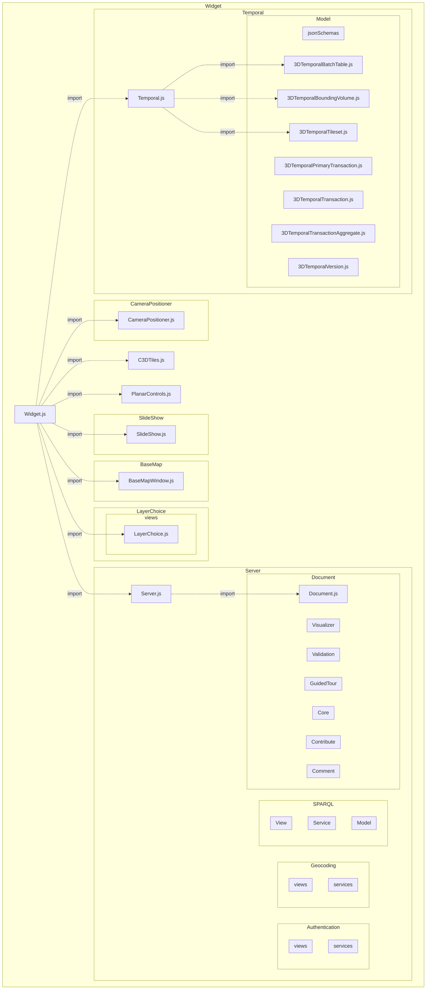

```mermaid
flowchart
 subgraph IDWidget["Widget"]
  IDWidgetC3DTilesjs["C3DTiles.js"]
  IDWidgetPlanarControlsjs["PlanarControls.js"]
  IDWidgetWidgetjs["Widget.js"]
  subgraph IDWidgetBaseMap["BaseMap"]
   IDWidgetBaseMapBaseMapWindowjs["BaseMapWindow.js"]
  end
  subgraph IDWidgetCameraPositioner["CameraPositioner"]
   IDWidgetCameraPositionerCameraPositionerjs["CameraPositioner.js"]
  end
  subgraph IDWidgetLayerChoice["LayerChoice"]
   subgraph IDWidgetLayerChoiceViews["views"]
    IDWidgetLayerChoiceViewsLayerChoicejs["LayerChoice.js"]
   end
  end
  subgraph IDWidgetServer["Server"]
   IDWidgetServerServerjs["Server.js"]
   subgraph IDWidgetServerAuthentication["Authentication"]
    subgraph IDWidgetServerAuthenticationServices["services"]
    end
    subgraph IDWidgetServerAuthenticationViews["views"]
    end
   end
   subgraph IDWidgetServerDocument["Document"]
    IDWidgetServerDocumentDocumentjs["Document.js"]
    subgraph IDWidgetServerDocumentComment["Comment"]
    end
    subgraph IDWidgetServerDocumentContribute["Contribute"]
    end
    subgraph IDWidgetServerDocumentCore["Core"]
    end
    subgraph IDWidgetServerDocumentGuidedTour["GuidedTour"]
    end
    subgraph IDWidgetServerDocumentValidation["Validation"]
    end
    subgraph IDWidgetServerDocumentVisualizer["Visualizer"]
    end
   end
   subgraph IDWidgetServerGeocoding["Geocoding"]
    subgraph IDWidgetServerGeocodingServices["services"]
    end
    subgraph IDWidgetServerGeocodingViews["views"]
    end
   end
   subgraph IDWidgetServerSPARQL["SPARQL"]
    subgraph IDWidgetServerSPARQLModel["Model"]
    end
    subgraph IDWidgetServerSPARQLService["Service"]
    end
    subgraph IDWidgetServerSPARQLView["View"]
    end
   end
  end
  subgraph IDWidgetSlideShow["SlideShow"]
   IDWidgetSlideShowSlideShowjs["SlideShow.js"]
  end
  subgraph IDWidgetTemporal["Temporal"]
   IDWidgetTemporalTemporaljs["Temporal.js"]
   subgraph IDWidgetTemporalModel["Model"]
    IDWidgetTemporalModel3DTemporalBatchTablejs["3DTemporalBatchTable.js"]
    IDWidgetTemporalModel3DTemporalBoundingVolumejs["3DTemporalBoundingVolume.js"]
    IDWidgetTemporalModel3DTemporalPrimaryTransactionjs["3DTemporalPrimaryTransaction.js"]
    IDWidgetTemporalModel3DTemporalTilesetjs["3DTemporalTileset.js"]
    IDWidgetTemporalModel3DTemporalTransactionjs["3DTemporalTransaction.js"]
    IDWidgetTemporalModel3DTemporalTransactionAggregatejs["3DTemporalTransactionAggregate.js"]
    IDWidgetTemporalModel3DTemporalVersionjs["3DTemporalVersion.js"]
    subgraph IDWidgetTemporalModelJsonSchemas["jsonSchemas"]
    end
   end
  end
 end
IDWidgetWidgetjs-.->|import|IDWidgetLayerChoiceViewsLayerChoicejs
IDWidgetWidgetjs-.->|import|IDWidgetCameraPositionerCameraPositionerjs
IDWidgetWidgetjs-.->|import|IDWidgetTemporalTemporaljs
IDWidgetWidgetjs-.->|import|IDWidgetSlideShowSlideShowjs
IDWidgetWidgetjs-.->|import|IDWidgetBaseMapBaseMapWindowjs
IDWidgetWidgetjs-.->|import|IDWidgetServerServerjs
IDWidgetWidgetjs-.->|import|IDWidgetC3DTilesjs
IDWidgetWidgetjs-.->|import|IDWidgetPlanarControlsjs
IDWidgetServerServerjs-.->|import|IDWidgetServerDocumentDocumentjs
IDWidgetTemporalTemporaljs-.->|import|IDWidgetTemporalModel3DTemporalBatchTablejs
IDWidgetTemporalTemporaljs-.->|import|IDWidgetTemporalModel3DTemporalBoundingVolumejs
IDWidgetTemporalTemporaljs-.->|import|IDWidgetTemporalModel3DTemporalTilesetjs
```