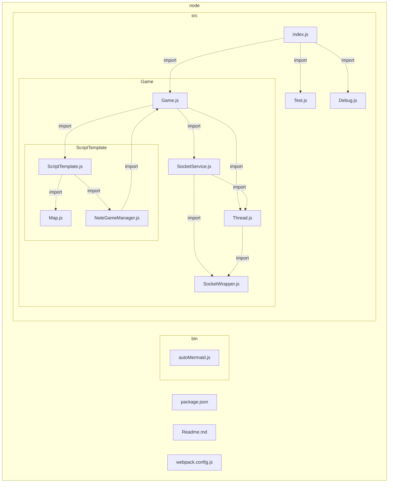

```mermaid
flowchart
 subgraph IDnode["node"]
  IDnodePackagejson["package.json"]
  IDnodeReadmemd["Readme.md"]
  IDnodeWebpackconfigjs["webpack.config.js"]
  subgraph IDnodeBin["bin"]
   IDnodeBinAutoMermaidjs["autoMermaid.js"]
  end
  subgraph IDnodeSrc["src"]
   IDnodeSrcDebugjs["Debug.js"]
   IDnodeSrcIndexjs["index.js"]
   IDnodeSrcTestjs["Test.js"]
   subgraph IDnodeSrcGame["Game"]
    IDnodeSrcGameGamejs["Game.js"]
    IDnodeSrcGameSocketServicejs["SocketService.js"]
    IDnodeSrcGameSocketWrapperjs["SocketWrapper.js"]
    IDnodeSrcGameThreadjs["Thread.js"]
    subgraph IDnodeSrcGameScriptTemplate["ScriptTemplate"]
     IDnodeSrcGameScriptTemplateMapjs["Map.js"]
     IDnodeSrcGameScriptTemplateNoteGameManagerjs["NoteGameManager.js"]
     IDnodeSrcGameScriptTemplateScriptTemplatejs["ScriptTemplate.js"]
    end
   end
  end
 end
IDnodeSrcIndexjs-.->|import|IDnodeSrcGameGamejs
IDnodeSrcIndexjs-.->|import|IDnodeSrcTestjs
IDnodeSrcIndexjs-.->|import|IDnodeSrcDebugjs
IDnodeSrcGameGamejs-.->|import|IDnodeSrcGameThreadjs
IDnodeSrcGameGamejs-.->|import|IDnodeSrcGameScriptTemplateScriptTemplatejs
IDnodeSrcGameGamejs-.->|import|IDnodeSrcGameSocketServicejs
IDnodeSrcGameSocketServicejs-.->|import|IDnodeSrcGameThreadjs
IDnodeSrcGameSocketServicejs-.->|import|IDnodeSrcGameSocketWrapperjs
IDnodeSrcGameThreadjs-.->|import|IDnodeSrcGameSocketWrapperjs
IDnodeSrcGameScriptTemplateNoteGameManagerjs-.->|import|IDnodeSrcGameGamejs
IDnodeSrcGameScriptTemplateScriptTemplatejs-.->|import|IDnodeSrcGameScriptTemplateMapjs
IDnodeSrcGameScriptTemplateScriptTemplatejs-.->|import|IDnodeSrcGameScriptTemplateNoteGameManagerjs
```