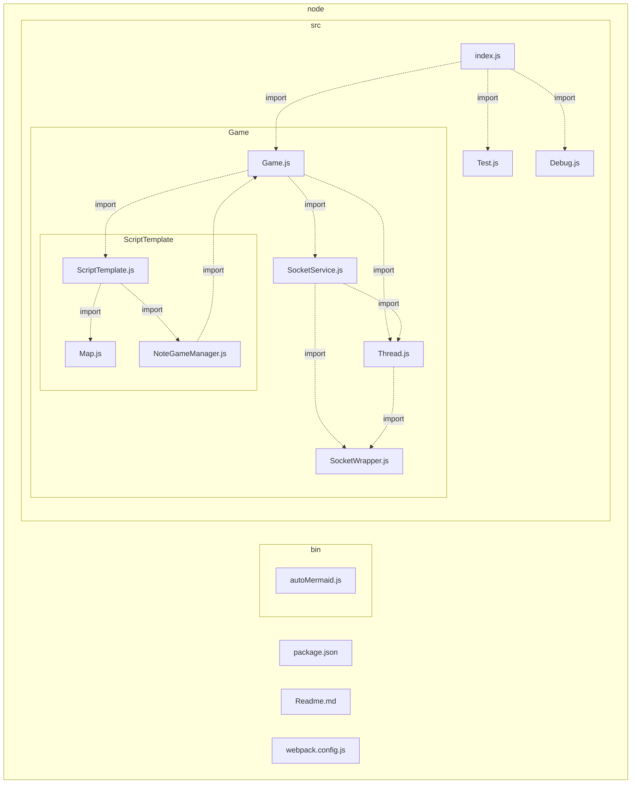

```mermaid
flowchart
 subgraph node[node]
  nodePackage.json[package.json]
  nodeReadme.md[Readme.md]
  nodeWebpack.config.js[webpack.config.js]
  subgraph nodeBin[bin]
   nodeBinAutoMermaid.js[autoMermaid.js]
  end
  subgraph nodeSrc[src]
   nodeSrcDebug.js[Debug.js]
   nodeSrcIndex.js[index.js]
   nodeSrcTest.js[Test.js]
   subgraph nodeSrcGame[Game]
    nodeSrcGameGame.js[Game.js]
    nodeSrcGameSocketService.js[SocketService.js]
    nodeSrcGameSocketWrapper.js[SocketWrapper.js]
    nodeSrcGameThread.js[Thread.js]
    subgraph nodeSrcGameScriptTemplate[ScriptTemplate]
     nodeSrcGameScriptTemplateMap.js[Map.js]
     nodeSrcGameScriptTemplateNoteGameManager.js[NoteGameManager.js]
     nodeSrcGameScriptTemplateScriptTemplate.js[ScriptTemplate.js]
    end
   end
  end
 end
nodeSrcIndex.js-.->|import|nodeSrcGameGame.js
nodeSrcIndex.js-.->|import|nodeSrcTest.js
nodeSrcIndex.js-.->|import|nodeSrcDebug.js
nodeSrcGameGame.js-.->|import|nodeSrcGameThread.js
nodeSrcGameGame.js-.->|import|nodeSrcGameScriptTemplateScriptTemplate.js
nodeSrcGameGame.js-.->|import|nodeSrcGameSocketService.js
nodeSrcGameSocketService.js-.->|import|nodeSrcGameThread.js
nodeSrcGameSocketService.js-.->|import|nodeSrcGameSocketWrapper.js
nodeSrcGameThread.js-.->|import|nodeSrcGameSocketWrapper.js
nodeSrcGameScriptTemplateNoteGameManager.js-.->|import|nodeSrcGameGame.js
nodeSrcGameScriptTemplateScriptTemplate.js-.->|import|nodeSrcGameScriptTemplateMap.js
nodeSrcGameScriptTemplateScriptTemplate.js-.->|import|nodeSrcGameScriptTemplateNoteGameManager.js
```