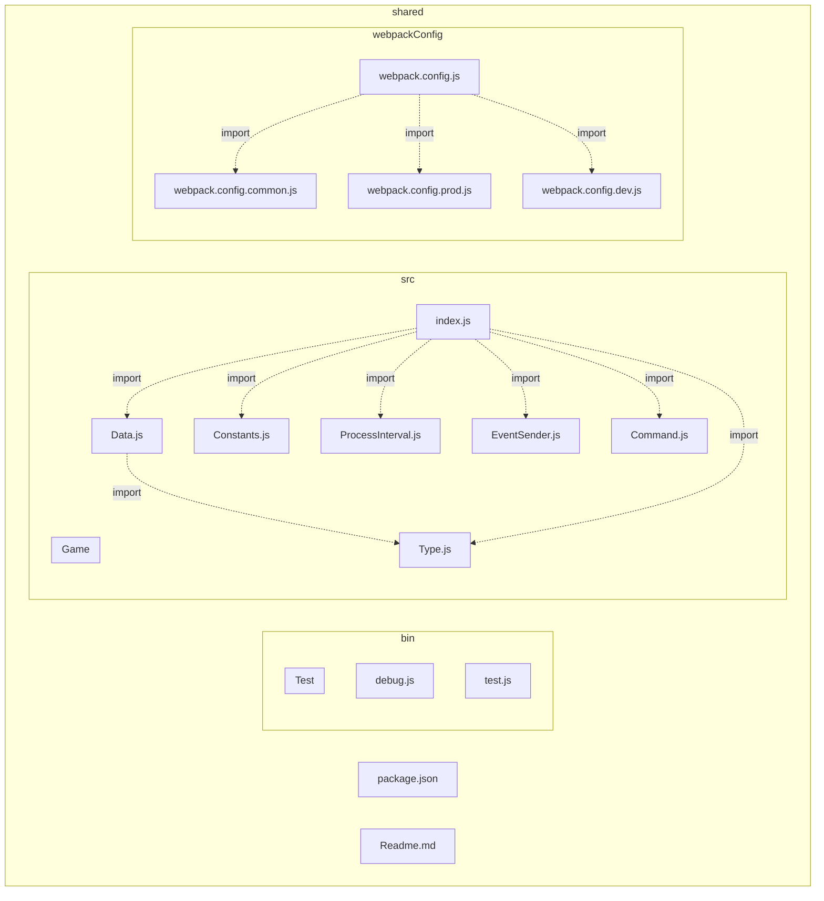

```mermaid
flowchart
 subgraph shared[shared]
  sharedPackage.json[package.json]
  sharedReadme.md[Readme.md]
  subgraph sharedBin[bin]
   sharedBinDebug.js[debug.js]
   sharedBinTest.js[test.js]
   subgraph sharedBinTest[Test]
   end
  end
  subgraph sharedSrc[src]
   sharedSrcCommand.js[Command.js]
   sharedSrcConstants.js[Constants.js]
   sharedSrcData.js[Data.js]
   sharedSrcEventSender.js[EventSender.js]
   sharedSrcIndex.js[index.js]
   sharedSrcProcessInterval.js[ProcessInterval.js]
   sharedSrcType.js[Type.js]
   subgraph sharedSrcGame[Game]
   end
  end
  subgraph sharedWebpackConfig[webpackConfig]
   sharedWebpackConfigWebpack.config.common.js[webpack.config.common.js]
   sharedWebpackConfigWebpack.config.dev.js[webpack.config.dev.js]
   sharedWebpackConfigWebpack.config.js[webpack.config.js]
   sharedWebpackConfigWebpack.config.prod.js[webpack.config.prod.js]
  end
 end
sharedSrcData.js-.->|import|sharedSrcType.js
sharedSrcIndex.js-.->|import|sharedSrcConstants.js
sharedSrcIndex.js-.->|import|sharedSrcData.js
sharedSrcIndex.js-.->|import|sharedSrcType.js
sharedSrcIndex.js-.->|import|sharedSrcProcessInterval.js
sharedSrcIndex.js-.->|import|sharedSrcEventSender.js
sharedSrcIndex.js-.->|import|sharedSrcCommand.js
sharedWebpackConfigWebpack.config.js-.->|import|sharedWebpackConfigWebpack.config.prod.js
sharedWebpackConfigWebpack.config.js-.->|import|sharedWebpackConfigWebpack.config.dev.js
sharedWebpackConfigWebpack.config.js-.->|import|sharedWebpackConfigWebpack.config.common.js
```