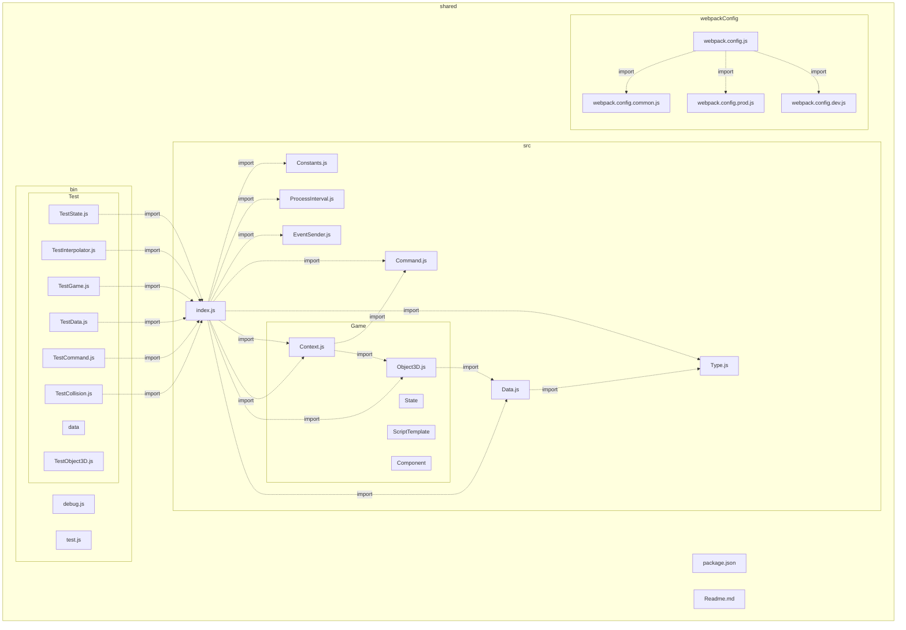

```mermaid
flowchart
 subgraph IDshared["shared"]
  IDsharedPackagejson["package.json"]
  IDsharedReadmemd["Readme.md"]
  subgraph IDsharedBin["bin"]
   IDsharedBinDebugjs["debug.js"]
   IDsharedBinTestjs["test.js"]
   subgraph IDsharedBinTest["Test"]
    IDsharedBinTestTestCollisionjs["TestCollision.js"]
    IDsharedBinTestTestCommandjs["TestCommand.js"]
    IDsharedBinTestTestDatajs["TestData.js"]
    IDsharedBinTestTestGamejs["TestGame.js"]
    IDsharedBinTestTestInterpolatorjs["TestInterpolator.js"]
    IDsharedBinTestTestObject3Djs["TestObject3D.js"]
    IDsharedBinTestTestStatejs["TestState.js"]
    subgraph IDsharedBinTestData["data"]
    end
   end
  end
  subgraph IDsharedSrc["src"]
   IDsharedSrcCommandjs["Command.js"]
   IDsharedSrcConstantsjs["Constants.js"]
   IDsharedSrcDatajs["Data.js"]
   IDsharedSrcEventSenderjs["EventSender.js"]
   IDsharedSrcIndexjs["index.js"]
   IDsharedSrcProcessIntervaljs["ProcessInterval.js"]
   IDsharedSrcTypejs["Type.js"]
   subgraph IDsharedSrcGame["Game"]
    IDsharedSrcGameContextjs["Context.js"]
    IDsharedSrcGameObject3Djs["Object3D.js"]
    subgraph IDsharedSrcGameComponent["Component"]
    end
    subgraph IDsharedSrcGameScriptTemplate["ScriptTemplate"]
    end
    subgraph IDsharedSrcGameState["State"]
    end
   end
  end
  subgraph IDsharedWebpackConfig["webpackConfig"]
   IDsharedWebpackConfigWebpackconfigcommonjs["webpack.config.common.js"]
   IDsharedWebpackConfigWebpackconfigdevjs["webpack.config.dev.js"]
   IDsharedWebpackConfigWebpackconfigjs["webpack.config.js"]
   IDsharedWebpackConfigWebpackconfigprodjs["webpack.config.prod.js"]
  end
 end
IDsharedBinTestTestCollisionjs-.->|import|IDsharedSrcIndexjs
IDsharedBinTestTestCommandjs-.->|import|IDsharedSrcIndexjs
IDsharedBinTestTestDatajs-.->|import|IDsharedSrcIndexjs
IDsharedBinTestTestGamejs-.->|import|IDsharedSrcIndexjs
IDsharedBinTestTestInterpolatorjs-.->|import|IDsharedSrcIndexjs
IDsharedBinTestTestStatejs-.->|import|IDsharedSrcIndexjs
IDsharedSrcDatajs-.->|import|IDsharedSrcTypejs
IDsharedSrcIndexjs-.->|import|IDsharedSrcConstantsjs
IDsharedSrcIndexjs-.->|import|IDsharedSrcDatajs
IDsharedSrcIndexjs-.->|import|IDsharedSrcTypejs
IDsharedSrcIndexjs-.->|import|IDsharedSrcProcessIntervaljs
IDsharedSrcIndexjs-.->|import|IDsharedSrcEventSenderjs
IDsharedSrcIndexjs-.->|import|IDsharedSrcCommandjs
IDsharedSrcIndexjs-.->|import|IDsharedSrcGameContextjs
IDsharedSrcIndexjs-.->|import|IDsharedSrcGameContextjs
IDsharedSrcIndexjs-.->|import|IDsharedSrcGameObject3Djs
IDsharedSrcGameContextjs-.->|import|IDsharedSrcGameObject3Djs
IDsharedSrcGameContextjs-.->|import|IDsharedSrcCommandjs
IDsharedSrcGameObject3Djs-.->|import|IDsharedSrcDatajs
IDsharedWebpackConfigWebpackconfigjs-.->|import|IDsharedWebpackConfigWebpackconfigprodjs
IDsharedWebpackConfigWebpackconfigjs-.->|import|IDsharedWebpackConfigWebpackconfigdevjs
IDsharedWebpackConfigWebpackconfigjs-.->|import|IDsharedWebpackConfigWebpackconfigcommonjs
```