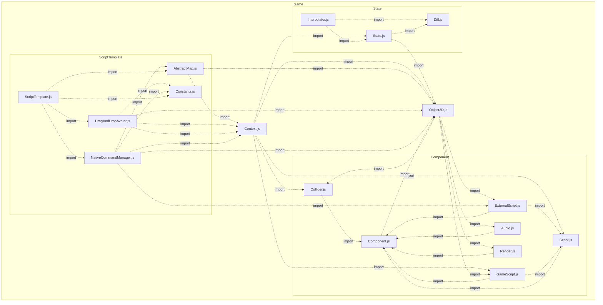

```mermaid
flowchart
 subgraph Game[Game]
  GameContext.js[Context.js]
  GameObject3D.js[Object3D.js]
  subgraph GameComponent[Component]
   GameComponentAudio.js[Audio.js]
   GameComponentCollider.js[Collider.js]
   GameComponentComponent.js[Component.js]
   GameComponentExternalScript.js[ExternalScript.js]
   GameComponentGameScript.js[GameScript.js]
   GameComponentRender.js[Render.js]
   GameComponentScript.js[Script.js]
  end
  subgraph GameScriptTemplate[ScriptTemplate]
   GameScriptTemplateAbstractMap.js[AbstractMap.js]
   GameScriptTemplateConstants.js[Constants.js]
   GameScriptTemplateDragAndDropAvatar.js[DragAndDropAvatar.js]
   GameScriptTemplateNativeCommandManager.js[NativeCommandManager.js]
   GameScriptTemplateScriptTemplate.js[ScriptTemplate.js]
  end
  subgraph GameState[State]
   GameStateDiff.js[Diff.js]
   GameStateInterpolator.js[Interpolator.js]
   GameStateState.js[State.js]
  end
 end
GameContext.js-.->|import|GameComponentCollider.js
GameContext.js-.->|import|GameComponentScript.js
GameContext.js-.->|import|GameComponentGameScript.js
GameContext.js-.->|import|GameObject3D.js
GameContext.js-.->|import|GameStateState.js
GameObject3D.js-.->|import|GameComponentExternalScript.js
GameObject3D.js-.->|import|GameComponentGameScript.js
GameObject3D.js-.->|import|GameComponentCollider.js
GameObject3D.js-.->|import|GameComponentAudio.js
GameObject3D.js-.->|import|GameComponentRender.js
GameComponentAudio.js-.->|import|GameComponentComponent.js
GameComponentCollider.js-.->|import|GameComponentComponent.js
GameComponentComponent.js-.->|import|GameObject3D.js
GameComponentExternalScript.js-.->|import|GameComponentComponent.js
GameComponentExternalScript.js-.->|import|GameComponentScript.js
GameComponentGameScript.js-.->|import|GameComponentComponent.js
GameComponentGameScript.js-.->|import|GameComponentScript.js
GameComponentRender.js-.->|import|GameComponentComponent.js
GameComponentScript.js-.->|import|GameComponentComponent.js
GameScriptTemplateAbstractMap.js-.->|import|GameContext.js
GameScriptTemplateAbstractMap.js-.->|import|GameObject3D.js
GameScriptTemplateDragAndDropAvatar.js-.->|import|GameContext.js
GameScriptTemplateDragAndDropAvatar.js-.->|import|GameContext.js
GameScriptTemplateDragAndDropAvatar.js-.->|import|GameScriptTemplateConstants.js
GameScriptTemplateDragAndDropAvatar.js-.->|import|GameObject3D.js
GameScriptTemplateNativeCommandManager.js-.->|import|GameContext.js
GameScriptTemplateNativeCommandManager.js-.->|import|GameScriptTemplateAbstractMap.js
GameScriptTemplateNativeCommandManager.js-.->|import|GameObject3D.js
GameScriptTemplateNativeCommandManager.js-.->|import|GameComponentExternalScript.js
GameScriptTemplateNativeCommandManager.js-.->|import|GameScriptTemplateConstants.js
GameScriptTemplateScriptTemplate.js-.->|import|GameScriptTemplateConstants.js
GameScriptTemplateScriptTemplate.js-.->|import|GameScriptTemplateDragAndDropAvatar.js
GameScriptTemplateScriptTemplate.js-.->|import|GameScriptTemplateNativeCommandManager.js
GameScriptTemplateScriptTemplate.js-.->|import|GameScriptTemplateAbstractMap.js
GameStateInterpolator.js-.->|import|GameStateState.js
GameStateInterpolator.js-.->|import|GameStateDiff.js
GameStateState.js-.->|import|GameStateDiff.js
GameStateState.js-.->|import|GameObject3D.js
```