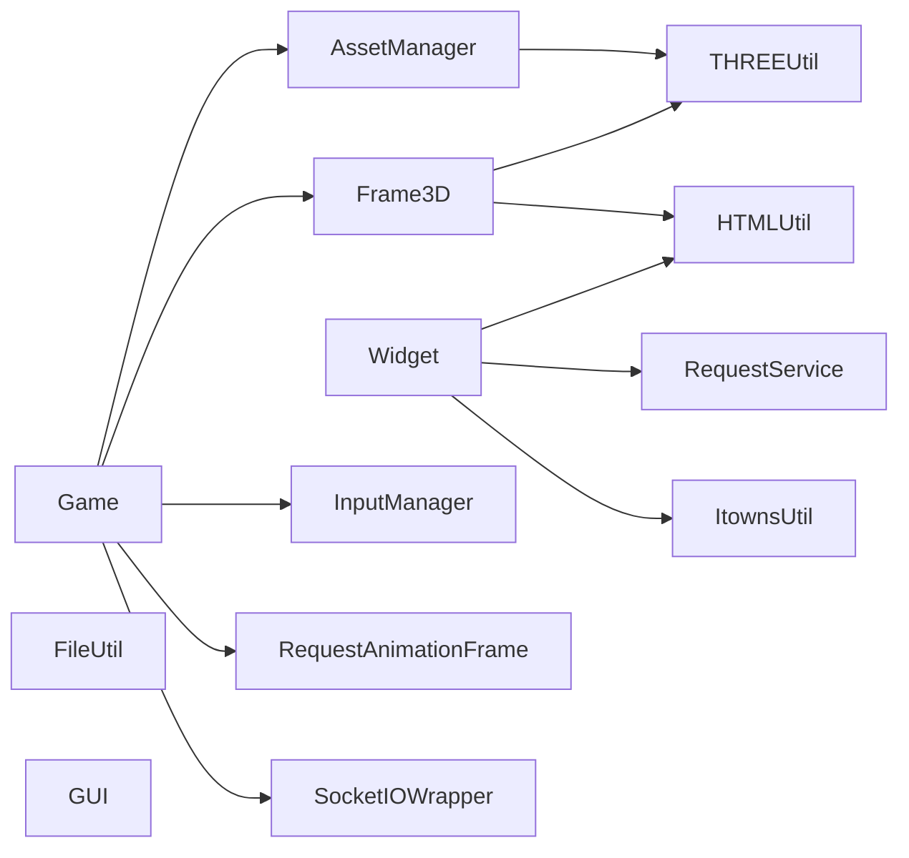

This is the entry points for @ud-viz/browser tutorials

# Dependency graph overview

<!--  -->

```mermaid
flowchart LR
AssetManager
Game
Frame3D
Widget
ItownsUtil
HTMLUtil
InputManager
RequestAnimationFrame
RequestService
SocketIOWrapper
THREEUtil
FileUtil
GUI
AssetManager --> THREEUtil
Frame3D --> THREEUtil
Frame3D --> HTMLUtil
Widget --> RequestService
Widget --> HTMLUtil
Widget --> ItownsUtil
Game --> AssetManager
Game --> Frame3D
Game --> InputManager
Game --> SocketIOWrapper
Game --> RequestAnimationFrame
```
