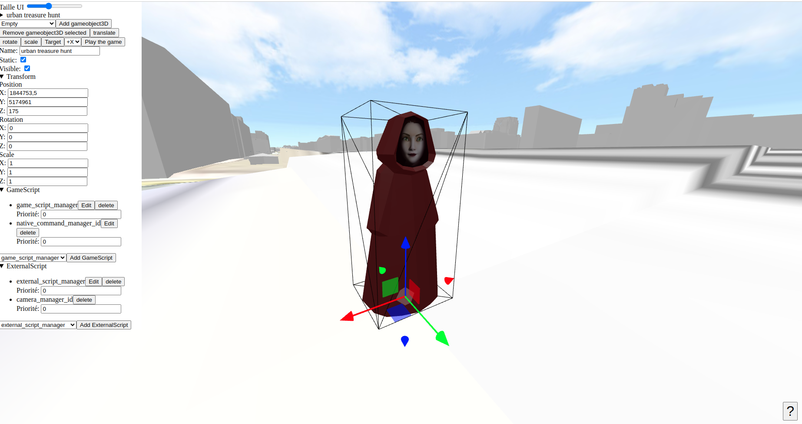
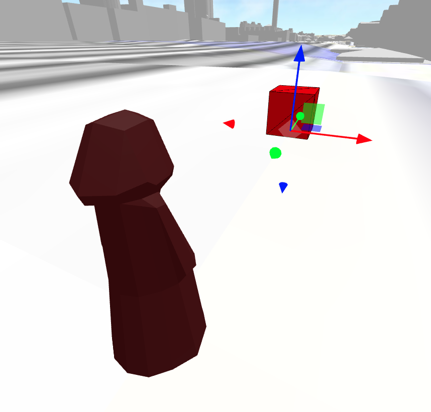
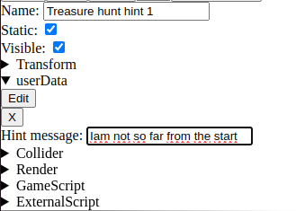

# Game editor example

[code of this example](https://github.com/VCityTeam/UD-Viz/blob/master/examples/game_editor.html)

## What to do in this example ??

This examples allows to create an urban treasure hunt !!

Select Treasure hunt hint and click "Add gameobject3D" button

A treasure hunt hint appears in scene move it wherever you want

Then edit the treasure hunt hint, message and its name

Then repeat for the number of hint you want to add

You can then play your treasure hunt by clicking Play game button [see](#tools)

## UI settings

- Taille ui: Slider to set the size of the user interface here the left pan

## Game object 3d hierarchy

- Game object 3d selection here the root game object 3d is "urban treasure hunt", you click on it to fold/unfold the hierarchy of your game

## Tools

- Add game object 3d, the default one is an empty game object 3d, you can select another one and add in the game object 3d selected, in this example a game object 3d model has been added and it's call "Treasure hunt hint"
- Remove game object 3d selected
- "translate" / "rotation" / "scale" will set the transform of the gizmo
- "Target" will target with the orbit controls the selected game object 3d
- select camera point of view (+x/-x/y/-y/z/-z)
- Play game will launch the current game object 2d edited [more detail](#in-game)

## Game object 3d input

- Name
- Static
- Visible
- position
- rotation
- scale
- userData
- ColliderComponent
- RenderComponent
- AudioComponent
- GameScriptComponent
- ExternalScriptComponent

## In game

Once in game you can move the avatar anc collect treasure hunt hint (collecting one will make appears the next one and so on). At the end you get a "Bravo". At any moment you can press Escape to return to the editor mode.
