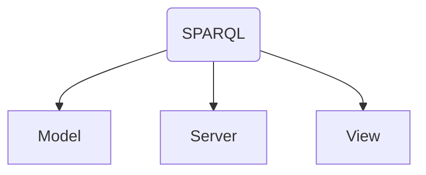

# SPARQL Module

The SPARQL Module adds basic functionality to query and visualize Semantic Web data stored in a Strabon Triple-store from a UD-Viz interface.

## Basic functionalities

The basic functionalities of the SPARQL module include:
- Query a [SPARQL Endpoint](https://github.com/VCityTeam/UD-SV/blob/master/Vocabulary/Readme.md#SPARQL-Endpoint) via HTTP request.
- Data is returned in the form of RDF and vizualised with [D3.js](https://d3js.org/) as a graph.
- The vizualised graph data can be used to select, focus on, and highlight corresponding to city objects.

## Usage

For an example of how to the SPARQL Widget to a UD-Viz web application see the [SPARQLWidget example](https://github.com/VCityTeam/UD-Viz/blob/master/packages/browser/examples/SPARQLWidget.html)

### User Interface

The Interface is composed of a **SPARQL Query** window containing a text box for composing queries to send to a [SPARQL Endpoint](https://github.com/VCityTeam/UD-SV/blob/master/Vocabulary/Readme.md#SPARQL-Endpoint).


The *Results Format* dropdown menu can be used to select how the query results will be visualised. Currently 3 formats are supported:
- [Graph](#Graph)
- [Table](#Table)
- [JSON](#JSON)

#### Graph View
A displayed graph can be zoomed in and out using the mouse wheel and panned by clicking and dragging the background of the graph. In addition, nodes can be moved by clicking and dragging them.


In order to propery colorize the nodes of a graph a SPARQL query must be formulated following a simple subject-predicate-object [RDF triple](https://github.com/VCityTeam/UD-SV/blob/master/Vocabulary/Readme.md#triple) structure. Colors will be assigned as a function each node's `rdf:type`. Thus 4 data must be selected:
- ?subject
- ?object
- ?predicate
- ?subjectType
- ?objectType

For example the following query on [this](https://github.com/VCityTeam/UD-Graph/blob/sparql-demo/SPARQL_Demo/data/LYON_1ER_BATI_2015-20_bldg-patched.rdf) RDF dataset returns all building city objects in a city model:
```sql
PREFIX rdf:  <http://www.w3.org/1999/02/22-rdf-syntax-ns#>
PREFIX rdfs: <http://www.w3.org/2000/01/rdf-schema#>
PREFIX owl:  <http://www.w3.org/2002/07/owl#>
PREFIX xsd:  <http://www.w3.org/2001/XMLSchema#>
PREFIX gmlowl:  <http://www.opengis.net/ont/gml#>
PREFIX units: <http://www.opengis.net/def/uom/OGC/1.0/>
PREFIX geo: <http://www.opengis.net/ont/geosparql#>
PREFIX geof: <http://www.opengis.net/def/function/geosparql/>
PREFIX strdf: <http://strdf.di.uoa.gr/ontology#>
PREFIX skos: <http://www.w3.org/2004/02/skos/core#>
PREFIX core: <http://www.opengis.net/citygml/2.0/core#>
PREFIX bldg: <http://www.opengis.net/citygml/building/2.0/building#>

# Return all CityGML City Objects
SELECT ?subject ?subjectType ?predicate ?object ?objectType
WHERE {
  ?subject a core:CityModel ;
    ?predicate ?object .
  ?subject a ?subjectType .
  ?object a bldg:Building .
  ?object a ?objectType .
  
  FILTER(?subjectType != <http://www.w3.org/2002/07/owl#NamedIndividual>)
  FILTER(?objectType != <http://www.w3.org/2002/07/owl#NamedIndividual>)
}
```

If the URIs of nodes in the graph correspond with identifiers of objects in the tileset batch table, they can be selected as shown below.


#### Table
The table view features a filter for searching for data within a column. In addition rows can be sorted in ascending or descending order by column.


#### JSON
The JSON view returns a collapsible representation of the query reponse.


## Code architecture

The SPARQL code is divided into 3 subfolders:


- The model classes are responsible for providing data structures for storing and formating the data returned by the server.
  - The `Table` and `Graph` classes use the [D3.js](https://d3js.org/) library to provide data structures for formating data from the `SparqlEndpointService`.
  - The `URI` class provides a data structure for storing URI strings.
- The server classes are responsible for providing an interface or adapter for transmitting data between the other module classes and the server.
  - The class responsible for making the requests is the `SparqlEndpointService`. Using a SPARQL query, it fetches [RDF](https://github.com/VCityTeam/UD-SV/blob/master/Vocabulary/Readme.md#resource-description-framework) data from the server as a JSON Object data structure.
  - The `SparqlEndpointResponseProvider` is an `EventSender` for informing classes subscribed to its events, when the `SparqlEndpointService` sends or receives data.
- The view is responsible for displaying the data retrieved from the view model and providing a user interface. It has a `SparqlWidgetView` class which manages a `SparqlQueryWindow` window class. This window is responsible for providing the user a form for entering and executing queries using the `SparqlEndpointResponseProvider` class and vizualising the data returned by the provider.

## Module Configuration
The module takes two configuration files:
1. Server configuration
2. Widget (view+model) configuration

### Widget Configuration
The minimal configuration required to make a SPARQL server class work is the following :
```json
{
  "url": "http://localhost:9999/strabon/",
  "url_parameters": "Query?handle=download&format=SPARQL/JSON&view=HTML&query="
}
```

- `sparqlModule.url` represents the base URL for the server. 
- `sparqlModule.url_parameters` represents the URL parameters to query the server via an HTTP request.

The SPARQL Query Service for interfacing with Strabon expects the URL to correspond to a REST API, where query routes are in the form `{url}{url_parameters}`

Parameters can also be configured to define custom queries in the interface:
See the [SparqlEndpointService](https://vcityteam.github.io/UD-Viz/html/browser/SparqlEndpointService.html) documentation for more information
### View/Model Configuration

The minimal configuration required to make a SPARQL Widget class work is the following :
```json
{
  "height": 500,
  "width": 500,
  "fontSize": 4,
}
```
- `height` the height (in pixels) of a d3 canvas for visualizing graphs
- `width` the width (in pixels) of a d3 canvas for visualizing graphs
- `fontSize` fontsize to be used in the d3 canvas for labeling graph nodes

Parameters can also be configured to define custom queries and to use custom labels instead of full URI namespaces in the legend. See the [graph](https://vcityteam.github.io/UD-Viz/html/browser/Graph_Graph.html) and [SparqlQueryWindow](https://vcityteam.github.io/UD-Viz/html/browser/SparqlQueryWindow.html) documentation for more information

