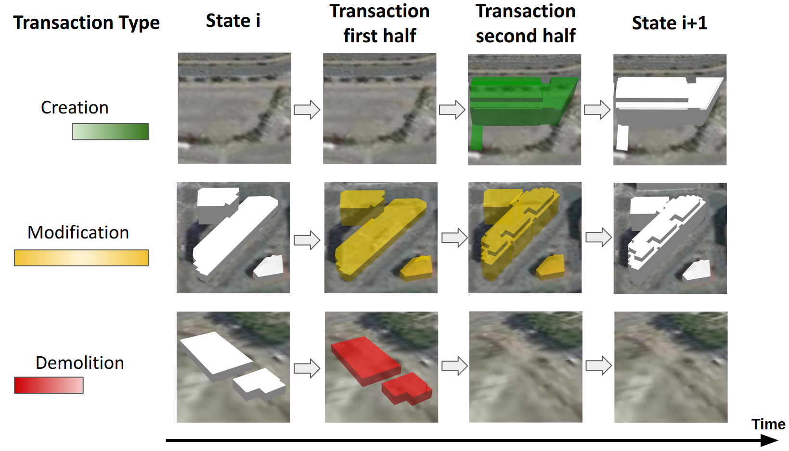
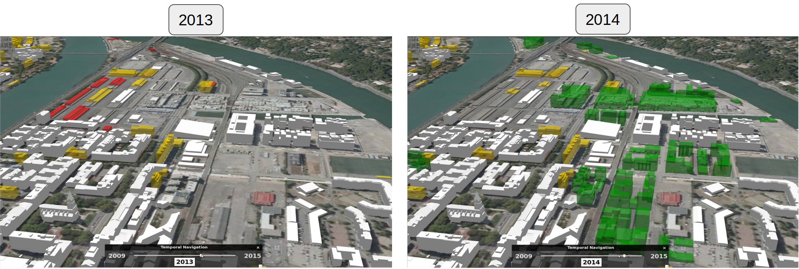

# @ud-viz/extensions_3d_tiles_temporal

[](https://npmjs.com/package/@ud-viz/extensions_3d_tiles_temporal)

An itowns C3DTExtensions to manage temporal evolution of 3DTiles.

## Model

You can find the jsonSchemas of the extensions [here](./src/model/jsonSchemas/) and the javascript class associated [there](./src/model/)

Transactions are stored in `C3DTilesLayer` in `tileset.extensions` and record all type of transaction between `C3DTFeature` which allow to assume `C3DTFeature` evolution over time .

## Temporal3DTilesLayerWrapper

This class apply a itowns `Style` to a `C3DTilesLayer` with the following rule:



> State i and State i+1 are the actual 3DTiles when they have been acquired at a date given. Transaction first half and Transaction second half are intermediary visualization state not corresponding to real date (the code are handling them like they were though)

Here you can see difference between two date.



### Example

```js
import * as itowns from 'itowns';
import {
  C3DTTemporalBatchTable,
  C3DTTemporalBoundingVolume,
  C3DTTemporalTileset,
  ID,
  Temporal3DTilesLayerWrapper,
} from '@ud-viz/extensions_3d_tiles_temporal';

// Create your itowns.C3DTExtensions
const extensions = new itowns.C3DTExtensions();
extensions.registerExtension(ID, {
  [itowns.C3DTilesTypes.batchtable]: C3DTTemporalBatchTable,
  [itowns.C3DTilesTypes.boundingVolume]: C3DTTemporalBoundingVolume,
  [itowns.C3DTilesTypes.tileset]: C3DTTemporalTileset,
});

// Create your itowns.C3DTilesLayer temporal
const c3DTilesLayer = new itowns.C3DTilesLayer(
  'layer_id',
  {
    source: new itowns.C3DTilesSource({
      url: 'url/to/your/3d/tiles/temporal/tileset.json',
    }),
    registeredExtensions: extensions,
  },
  view // your itowns.View
);

// Add your layer to the view
itowns.View.prototype.addLayer.call(view, c3DTilesLayer);

// Create your Temporal3DTilesLayerWrapper
const temporal3DTilesLayerWrapper = new Temporal3DTilesLayerWrapper(
  c3DTilesLayer
);

// Select the date you want to visualize
temporal3DTilesLayerWrapper.styleDate = date; // note that if the date does not exists in 3DTiles it will select the closer one
view.notifyChange(); // refresh view
```

> you can find an implementation [here](https://github.com/VCityTeam/UD-Viz/blob/master/examples/extensions_3d_tiles_temporal.html)
