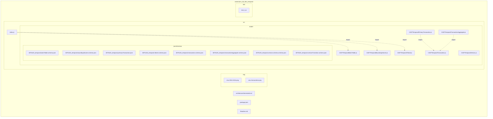

```mermaid
flowchart
 subgraph IDextensions5f3d5ftiles5ftemporal["extensions_3d_tiles_temporal"]
  IDextensions5f3d5ftiles5ftemporalArchitectureGenerated2emd["architectureGenerated.md"]
  IDextensions5f3d5ftiles5ftemporalPackage2ejson["package.json"]
  IDextensions5f3d5ftiles5ftemporalReadme2emd["Readme.md"]
  subgraph IDextensions5f3d5ftiles5ftemporalImg["img"]
   IDextensions5f3d5ftiles5ftemporalImgVisu2d20132d20142epng["visu-2013-2014.png"]
   IDextensions5f3d5ftiles5ftemporalImgVisu2dtransactions2epng["visu-transactions.png"]
  end
  subgraph IDextensions5f3d5ftiles5ftemporalSrc["src"]
   IDextensions5f3d5ftiles5ftemporalSrcIndex2ejs["index.js"]
   subgraph IDextensions5f3d5ftiles5ftemporalSrcModel["model"]
    IDextensions5f3d5ftiles5ftemporalSrcModelC3DTTemporalBatchTable2ejs["C3DTTemporalBatchTable.js"]
    IDextensions5f3d5ftiles5ftemporalSrcModelC3DTTemporalBoundingVolume2ejs["C3DTTemporalBoundingVolume.js"]
    IDextensions5f3d5ftiles5ftemporalSrcModelC3DTTemporalPrimaryTransaction2ejs["C3DTTemporalPrimaryTransaction.js"]
    IDextensions5f3d5ftiles5ftemporalSrcModelC3DTTemporalTileset2ejs["C3DTTemporalTileset.js"]
    IDextensions5f3d5ftiles5ftemporalSrcModelC3DTTemporalTransaction2ejs["C3DTTemporalTransaction.js"]
    IDextensions5f3d5ftiles5ftemporalSrcModelC3DTTemporalTransactionAggregate2ejs["C3DTTemporalTransactionAggregate.js"]
    IDextensions5f3d5ftiles5ftemporalSrcModelC3DTTemporalVersion2ejs["C3DTTemporalVersion.js"]
    subgraph IDextensions5f3d5ftiles5ftemporalSrcModelJsonSchemas["jsonSchemas"]
     IDextensions5f3d5ftiles5ftemporalSrcModelJsonSchemas3DTILES5ftemporal2ebatchTable2eschema2ejson["3DTILES_temporal.batchTable.schema.json"]
     IDextensions5f3d5ftiles5ftemporalSrcModelJsonSchemas3DTILES5ftemporal2eboundingVolume2eschema2ejson["3DTILES_temporal.boundingVolume.schema.json"]
     IDextensions5f3d5ftiles5ftemporalSrcModelJsonSchemas3DTILES5ftemporal2eprimaryTransaction2ejson["3DTILES_temporal.primaryTransaction.json"]
     IDextensions5f3d5ftiles5ftemporalSrcModelJsonSchemas3DTILES5ftemporal2etileset2eschema2ejson["3DTILES_temporal.tileset.schema.json"]
     IDextensions5f3d5ftiles5ftemporalSrcModelJsonSchemas3DTILES5ftemporal2etransaction2eschema2ejson["3DTILES_temporal.transaction.schema.json"]
     IDextensions5f3d5ftiles5ftemporalSrcModelJsonSchemas3DTILES5ftemporal2etransactionAggregate2eschema2ejson["3DTILES_temporal.transactionAggregate.schema.json"]
     IDextensions5f3d5ftiles5ftemporalSrcModelJsonSchemas3DTILES5ftemporal2eversion2eschema2eschema2ejson["3DTILES_temporal.version.schema.schema.json"]
     IDextensions5f3d5ftiles5ftemporalSrcModelJsonSchemas3DTILES5ftemporal2eversionTransition2eschema2ejson["3DTILES_temporal.versionTransition.schema.json"]
    end
   end
  end
  subgraph IDextensions5f3d5ftiles5ftemporalTest["test"]
   IDextensions5f3d5ftiles5ftemporalTestTest5f12ejs["test_1.js"]
  end
 end
IDextensions5f3d5ftiles5ftemporalSrcIndex2ejs-.->|import|IDextensions5f3d5ftiles5ftemporalSrcModelC3DTTemporalBatchTable2ejs
IDextensions5f3d5ftiles5ftemporalSrcIndex2ejs-.->|import|IDextensions5f3d5ftiles5ftemporalSrcModelC3DTTemporalBoundingVolume2ejs
IDextensions5f3d5ftiles5ftemporalSrcIndex2ejs-.->|import|IDextensions5f3d5ftiles5ftemporalSrcModelC3DTTemporalTileset2ejs
IDextensions5f3d5ftiles5ftemporalSrcModelC3DTTemporalPrimaryTransaction2ejs-.->|import|IDextensions5f3d5ftiles5ftemporalSrcModelC3DTTemporalTransaction2ejs
IDextensions5f3d5ftiles5ftemporalSrcModelC3DTTemporalTransactionAggregate2ejs-.->|import|IDextensions5f3d5ftiles5ftemporalSrcModelC3DTTemporalTransaction2ejs
```