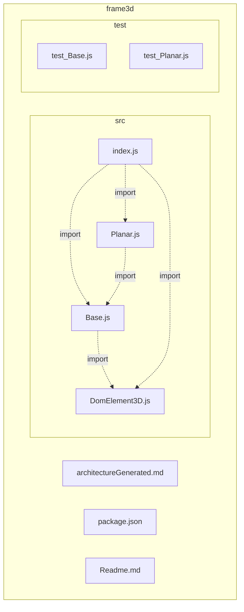

```mermaid
flowchart
 subgraph IDframe3d["frame3d"]
  IDframe3dArchitectureGenerated2emd["architectureGenerated.md"]
  IDframe3dPackage2ejson["package.json"]
  IDframe3dReadme2emd["Readme.md"]
  subgraph IDframe3dSrc["src"]
   IDframe3dSrcBase2ejs["Base.js"]
   IDframe3dSrcDomElement3D2ejs["DomElement3D.js"]
   IDframe3dSrcIndex2ejs["index.js"]
   IDframe3dSrcPlanar2ejs["Planar.js"]
  end
  subgraph IDframe3dTest["test"]
   IDframe3dTestTest5fBase2ejs["test_Base.js"]
   IDframe3dTestTest5fPlanar2ejs["test_Planar.js"]
  end
 end
IDframe3dSrcBase2ejs-.->|import|IDframe3dSrcDomElement3D2ejs
IDframe3dSrcIndex2ejs-.->|import|IDframe3dSrcPlanar2ejs
IDframe3dSrcIndex2ejs-.->|import|IDframe3dSrcBase2ejs
IDframe3dSrcIndex2ejs-.->|import|IDframe3dSrcDomElement3D2ejs
IDframe3dSrcPlanar2ejs-.->|import|IDframe3dSrcBase2ejs
```