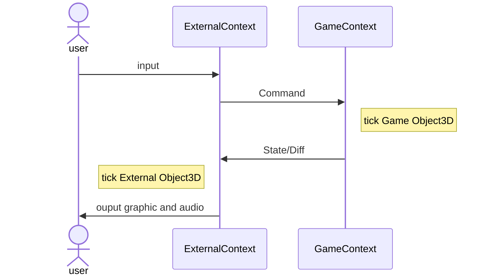

# @ud-viz/game_browser

[](https://npmjs.com/package/@ud-viz/game_browser)

Game library interpretable in a browser environment based on itowns. Before to start you should read [@ud-viz/game_shared](../game_shared/Readme.md).

There is two `Context` in @ud-viz/game_xxx, one is in `@ud-viz/game_shared` let's call it GameContext and the other is in `@ud-viz/game_browser` let's call it ExternalContext.

Here is a diagram giving an overview of how works both Context together



##  Overview

There is two type of `@ud-viz/game_browser` process, one can be running exclusively in the browser `SinglePlanarProcess` (GameContext and ExternalContext are in the same process), whereas in the other one `MultiPlanarProcess` GameContext is running on a backend with [@ud-viz/game_node](../game_node/Readme.md) and ExternalContext is running in the browser (communication is made with [socket.io](https://socket.io/)).

## Example

### `SinglePlanarProcess`

```js
import { SinglePlanarProcess } from '@ud-viz/game_browser';
import { Object3D } from '@ud-viz/game_shared';
import { Planar } from '@ud-viz/frame3d';
import * as itowns from 'itowns';

const crs = 'EPSG:3857';

const extent = new itowns.Extent(crs, 1837860, 1851647, 5169347, 5180575);
const process = new SinglePlanarProcess(new Object3D({}), new Planar(extent));
process.start();
```

> you can find an implementation [here](https://github.com/VCityTeam/UD-Viz/blob/master/examples/game_zeppelin.html)

### `MultiPlanarProcess`

```js
import { MultiPlanarProcess, SocketIOWrapper } from '@ud-viz/game_browser';
import * as itowns from 'itowns';

const crs = 'EPSG:3857';

const extent = new itowns.Extent(crs, 1837860, 1851647, 5169347, 5180575);
const process = new MultiPlanarProcess(new SocketIOWrapper(), extent);
process.start();
```

> you can find an implementation [here](https://github.com/VCityTeam/UD-Viz/blob/master/examples/game_note.html) working with [this backend](../../bin/backEnd.js)

> [Documentation](https://vcityteam.github.io/UD-Viz/html/game_browser/)
