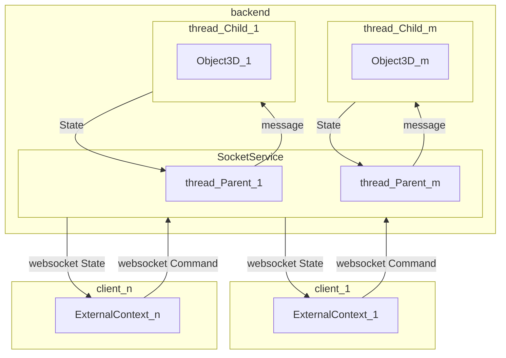

# @ud-viz/game_node

[](https://npmjs.com/package/@ud-viz/game_node)

Game library interpretable in a nodejs environment. Before to start you should read [@ud-viz/game_shared](../game_shared/Readme.md) and [@ud-viz/game_browser](../game_browser/Readme.md).

## Overview

`@ud-viz/game_node` package allows to create a backend `SocketService` working with [socket.io](https://socket.io/) to communicate with clients implement with `@ud-viz/game_browser`. `SocketService` takes an array of `Object3D` and will instanciated a thread for each of them with [worker_threads](https://nodejs.org/api/worker_threads.html) where `Object3D` is running. Then it handles websocket communication with threads.



##  Example

### Parent entry

```js
const { SocketService } = require('@ud-viz/game_node');
const { Object3D } = require('@ud-viz/game_shared');

const socketService = new SocketService(httpServer);
socketService.loadGameThreads(
  [new Object3D({ name: 'game_1' }), new Object3D({ name: 'game_2' })],
  './path/to/your/thread/child/entry.js'
);
```

> you can find an implementation [here](https://github.com/VCityTeam/UD-Viz/blob/master/bin/backEnd.js)

### Child entry

```js
const { thread } = require('@ud-viz/game_node');

const child = new thread.Child();
child.start([scriptsOfYourGames]);
```

> you can find an implementation [here](https://github.com/VCityTeam/UD-Viz/blob/master/bin/gameThreadChild.js)

> [Documentation](https://vcityteam.github.io/UD-Viz/html/game_node/)
