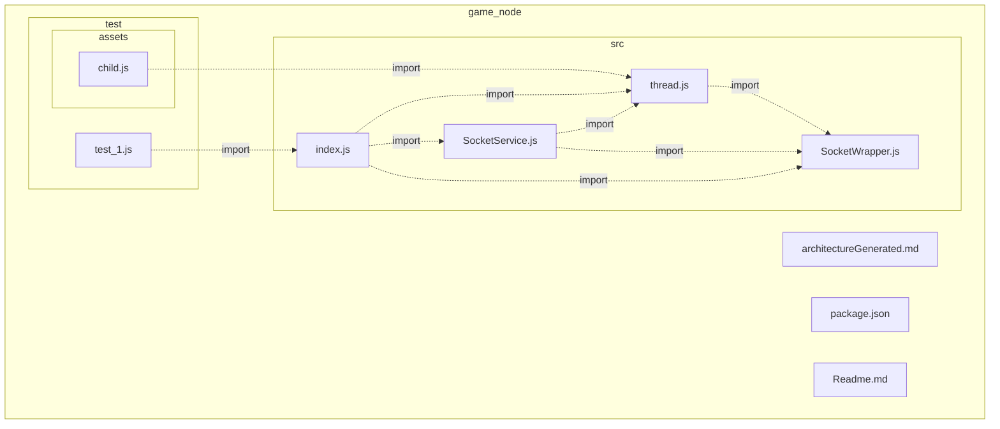

```mermaid
flowchart
 subgraph IDgame5fnode["game_node"]
  IDgame5fnodeArchitectureGenerated2emd["architectureGenerated.md"]
  IDgame5fnodePackage2ejson["package.json"]
  IDgame5fnodeReadme2emd["Readme.md"]
  subgraph IDgame5fnodeSrc["src"]
   IDgame5fnodeSrcIndex2ejs["index.js"]
   IDgame5fnodeSrcSocketService2ejs["SocketService.js"]
   IDgame5fnodeSrcSocketWrapper2ejs["SocketWrapper.js"]
   IDgame5fnodeSrcThread2ejs["thread.js"]
  end
  subgraph IDgame5fnodeTest["test"]
   IDgame5fnodeTestTest5f12ejs["test_1.js"]
   subgraph IDgame5fnodeTestAssets["assets"]
    IDgame5fnodeTestAssetsChild2ejs["child.js"]
   end
  end
 end
IDgame5fnodeSrcIndex2ejs-.->|import|IDgame5fnodeSrcThread2ejs
IDgame5fnodeSrcIndex2ejs-.->|import|IDgame5fnodeSrcSocketService2ejs
IDgame5fnodeSrcIndex2ejs-.->|import|IDgame5fnodeSrcSocketWrapper2ejs
IDgame5fnodeSrcSocketService2ejs-.->|import|IDgame5fnodeSrcThread2ejs
IDgame5fnodeSrcSocketService2ejs-.->|import|IDgame5fnodeSrcSocketWrapper2ejs
IDgame5fnodeSrcThread2ejs-.->|import|IDgame5fnodeSrcSocketWrapper2ejs
IDgame5fnodeTestTest5f12ejs-.->|import|IDgame5fnodeSrcIndex2ejs
IDgame5fnodeTestAssetsChild2ejs-.->|import|IDgame5fnodeSrcThread2ejs
```