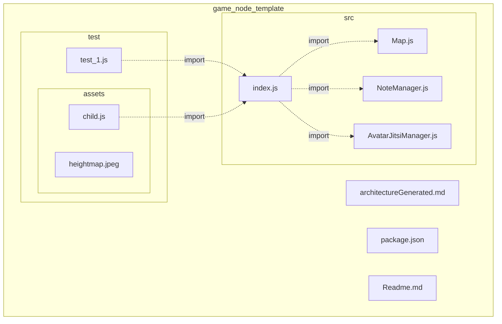

```mermaid
flowchart
 subgraph IDgame5fnode5ftemplate["game_node_template"]
  IDgame5fnode5ftemplateArchitectureGenerated2emd["architectureGenerated.md"]
  IDgame5fnode5ftemplatePackage2ejson["package.json"]
  IDgame5fnode5ftemplateReadme2emd["Readme.md"]
  subgraph IDgame5fnode5ftemplateSrc["src"]
   IDgame5fnode5ftemplateSrcAvatarJitsiManager2ejs["AvatarJitsiManager.js"]
   IDgame5fnode5ftemplateSrcIndex2ejs["index.js"]
   IDgame5fnode5ftemplateSrcMap2ejs["Map.js"]
   IDgame5fnode5ftemplateSrcNoteManager2ejs["NoteManager.js"]
  end
  subgraph IDgame5fnode5ftemplateTest["test"]
   IDgame5fnode5ftemplateTestTest5f12ejs["test_1.js"]
   subgraph IDgame5fnode5ftemplateTestAssets["assets"]
    IDgame5fnode5ftemplateTestAssetsChild2ejs["child.js"]
    IDgame5fnode5ftemplateTestAssetsHeightmap2ejpeg["heightmap.jpeg"]
   end
  end
 end
IDgame5fnode5ftemplateSrcIndex2ejs-.->|import|IDgame5fnode5ftemplateSrcMap2ejs
IDgame5fnode5ftemplateSrcIndex2ejs-.->|import|IDgame5fnode5ftemplateSrcNoteManager2ejs
IDgame5fnode5ftemplateSrcIndex2ejs-.->|import|IDgame5fnode5ftemplateSrcAvatarJitsiManager2ejs
IDgame5fnode5ftemplateTestTest5f12ejs-.->|import|IDgame5fnode5ftemplateSrcIndex2ejs
IDgame5fnode5ftemplateTestAssetsChild2ejs-.->|import|IDgame5fnode5ftemplateSrcIndex2ejs
```