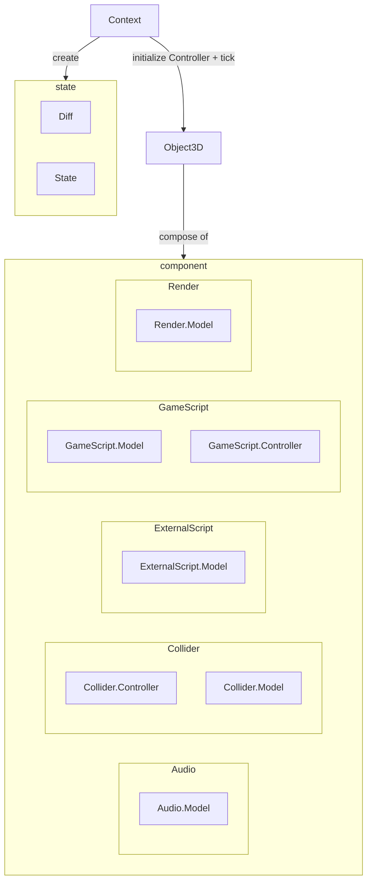

# @ud-viz/game_shared

[](https://npmjs.com/package/@ud-viz/game_shared)

Game library interpretable in a nodejs and in a browser environment based on [THREE.js](https://github.com/mrdoob/three.js/releases).

Since the library is interpretable in a nodejs environment there is no output (audio, graphic) and input. In that case you need to use [@ud-viz/game_browser](https://github.com/VCityTeam/UD-Viz/blob/master/packages/game_browser/Readme.md)

## Overview



> Some component (ones needing the web api to works) don't have `Controller` meaning these component are not controlled by `Context`. Only `Model` is manipulated.


### Installation

You can install `@ud-viz/game_shared` via npm:

```bash
npm install @ud-viz/game_shared
```


## Example

```js
const { ScriptBase, Context, Object3D } = require('@ud-viz/game_shared');

// Create a game script to compose your Object3D
const GameScript = class extends ScriptBase {
  // add your method
  myMethod() {}

  // different event dispatch by Context
  load() {
    console.log('loading');
  }

  init() {
    console.log('init');
  }

  tick() {
    console.log('tick');
  }

  onEnterCollision() {
    console.log('onEnterCollision');
  }

  isColliding() {
    console.log('isColliding');
  }

  onLeaveCollision() {
    console.log('onLeaveCollision');
  }

  // your script id
  static get ID_SCRIPT() {
    return 'id_script';
  }
};

// Create your @ud-viz/game_shared Context
const context = new Context(
  [GameScript],
  new Object3D({
    components: {
      GameScript: {
        idScripts: [GameScript.ID_SCRIPT],
      },
    },
  })
);

// Load and step your game
context.load().then(() => {
  setInterval(() => context.step(), 50);
});
```

## Documentation

> [Online Documentation](https://vcityteam.github.io/UD-Viz/html/game_shared/)


## Contributing

Contributions are welcome! Feel free to submit bug reports, feature requests, or pull requests on the GitHub repository. See [Contributing.md](https://github.com/VCityTeam/UD-Viz/blob/master/docs/static/Contributing.md).

## License

This package is licensed under the [GNU Lesser General Public License Version 2.1](https://github.com/VCityTeam/UD-Viz/blob/master/LICENSE.md), with copyright attributed to the University of Lyon.

## Credits

`@ud-viz/game_shared` is developed and maintained by [VCityTeam](https://github.com/VCityTeam). See [Contributors.md](https://github.com/VCityTeam/UD-Viz/blob/master/docs/static/Contributors.md).