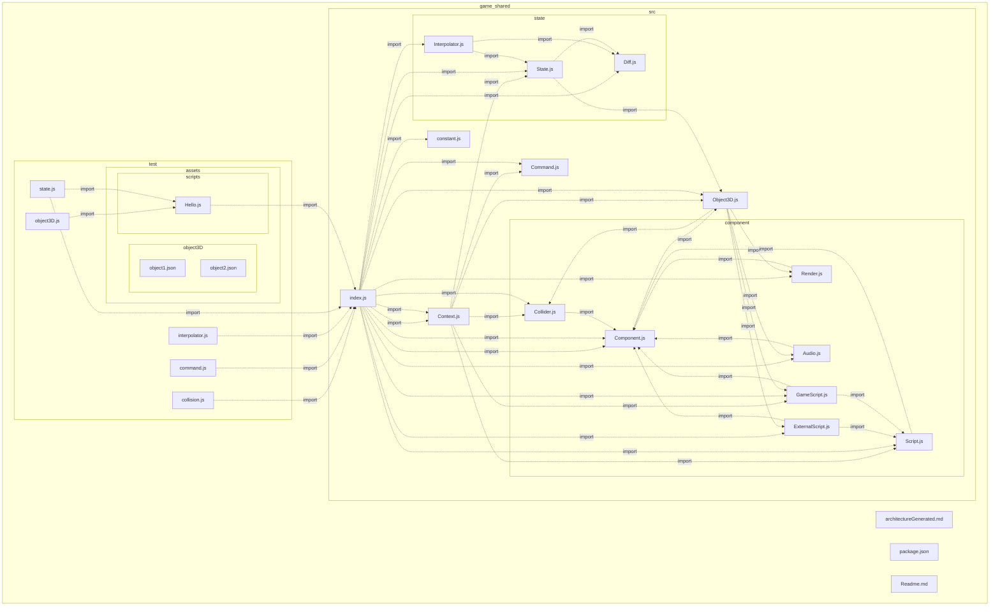

```mermaid
flowchart
 subgraph IDgame5fshared["game_shared"]
  IDgame5fsharedArchitectureGenerated2emd["architectureGenerated.md"]
  IDgame5fsharedPackage2ejson["package.json"]
  IDgame5fsharedReadme2emd["Readme.md"]
  subgraph IDgame5fsharedSrc["src"]
   IDgame5fsharedSrcCommand2ejs["Command.js"]
   IDgame5fsharedSrcConstant2ejs["constant.js"]
   IDgame5fsharedSrcContext2ejs["Context.js"]
   IDgame5fsharedSrcIndex2ejs["index.js"]
   IDgame5fsharedSrcObject3D2ejs["Object3D.js"]
   subgraph IDgame5fsharedSrcComponent["component"]
    IDgame5fsharedSrcComponentAudio2ejs["Audio.js"]
    IDgame5fsharedSrcComponentCollider2ejs["Collider.js"]
    IDgame5fsharedSrcComponentComponent2ejs["Component.js"]
    IDgame5fsharedSrcComponentExternalScript2ejs["ExternalScript.js"]
    IDgame5fsharedSrcComponentGameScript2ejs["GameScript.js"]
    IDgame5fsharedSrcComponentRender2ejs["Render.js"]
    IDgame5fsharedSrcComponentScript2ejs["Script.js"]
   end
   subgraph IDgame5fsharedSrcState["state"]
    IDgame5fsharedSrcStateDiff2ejs["Diff.js"]
    IDgame5fsharedSrcStateInterpolator2ejs["Interpolator.js"]
    IDgame5fsharedSrcStateState2ejs["State.js"]
   end
  end
  subgraph IDgame5fsharedTest["test"]
   IDgame5fsharedTestCollision2ejs["collision.js"]
   IDgame5fsharedTestCommand2ejs["command.js"]
   IDgame5fsharedTestInterpolator2ejs["interpolator.js"]
   IDgame5fsharedTestObject3D2ejs["object3D.js"]
   IDgame5fsharedTestState2ejs["state.js"]
   subgraph IDgame5fsharedTestAssets["assets"]
    subgraph IDgame5fsharedTestAssetsObject3D["object3D"]
     IDgame5fsharedTestAssetsObject3DObject12ejson["object1.json"]
     IDgame5fsharedTestAssetsObject3DObject22ejson["object2.json"]
    end
    subgraph IDgame5fsharedTestAssetsScripts["scripts"]
     IDgame5fsharedTestAssetsScriptsHello2ejs["Hello.js"]
    end
   end
  end
 end
IDgame5fsharedSrcContext2ejs-.->|import|IDgame5fsharedSrcComponentCollider2ejs
IDgame5fsharedSrcContext2ejs-.->|import|IDgame5fsharedSrcComponentScript2ejs
IDgame5fsharedSrcContext2ejs-.->|import|IDgame5fsharedSrcComponentGameScript2ejs
IDgame5fsharedSrcContext2ejs-.->|import|IDgame5fsharedSrcObject3D2ejs
IDgame5fsharedSrcContext2ejs-.->|import|IDgame5fsharedSrcStateState2ejs
IDgame5fsharedSrcContext2ejs-.->|import|IDgame5fsharedSrcCommand2ejs
IDgame5fsharedSrcIndex2ejs-.->|import|IDgame5fsharedSrcConstant2ejs
IDgame5fsharedSrcIndex2ejs-.->|import|IDgame5fsharedSrcCommand2ejs
IDgame5fsharedSrcIndex2ejs-.->|import|IDgame5fsharedSrcContext2ejs
IDgame5fsharedSrcIndex2ejs-.->|import|IDgame5fsharedSrcContext2ejs
IDgame5fsharedSrcIndex2ejs-.->|import|IDgame5fsharedSrcObject3D2ejs
IDgame5fsharedSrcIndex2ejs-.->|import|IDgame5fsharedSrcStateInterpolator2ejs
IDgame5fsharedSrcIndex2ejs-.->|import|IDgame5fsharedSrcStateState2ejs
IDgame5fsharedSrcIndex2ejs-.->|import|IDgame5fsharedSrcStateDiff2ejs
IDgame5fsharedSrcIndex2ejs-.->|import|IDgame5fsharedSrcComponentRender2ejs
IDgame5fsharedSrcIndex2ejs-.->|import|IDgame5fsharedSrcComponentCollider2ejs
IDgame5fsharedSrcIndex2ejs-.->|import|IDgame5fsharedSrcComponentAudio2ejs
IDgame5fsharedSrcIndex2ejs-.->|import|IDgame5fsharedSrcComponentExternalScript2ejs
IDgame5fsharedSrcIndex2ejs-.->|import|IDgame5fsharedSrcComponentGameScript2ejs
IDgame5fsharedSrcIndex2ejs-.->|import|IDgame5fsharedSrcComponentScript2ejs
IDgame5fsharedSrcIndex2ejs-.->|import|IDgame5fsharedSrcComponentComponent2ejs
IDgame5fsharedSrcIndex2ejs-.->|import|IDgame5fsharedSrcComponentComponent2ejs
IDgame5fsharedSrcObject3D2ejs-.->|import|IDgame5fsharedSrcComponentExternalScript2ejs
IDgame5fsharedSrcObject3D2ejs-.->|import|IDgame5fsharedSrcComponentGameScript2ejs
IDgame5fsharedSrcObject3D2ejs-.->|import|IDgame5fsharedSrcComponentCollider2ejs
IDgame5fsharedSrcObject3D2ejs-.->|import|IDgame5fsharedSrcComponentAudio2ejs
IDgame5fsharedSrcObject3D2ejs-.->|import|IDgame5fsharedSrcComponentRender2ejs
IDgame5fsharedSrcComponentAudio2ejs-.->|import|IDgame5fsharedSrcComponentComponent2ejs
IDgame5fsharedSrcComponentCollider2ejs-.->|import|IDgame5fsharedSrcComponentComponent2ejs
IDgame5fsharedSrcComponentComponent2ejs-.->|import|IDgame5fsharedSrcObject3D2ejs
IDgame5fsharedSrcComponentExternalScript2ejs-.->|import|IDgame5fsharedSrcComponentComponent2ejs
IDgame5fsharedSrcComponentExternalScript2ejs-.->|import|IDgame5fsharedSrcComponentScript2ejs
IDgame5fsharedSrcComponentGameScript2ejs-.->|import|IDgame5fsharedSrcComponentComponent2ejs
IDgame5fsharedSrcComponentGameScript2ejs-.->|import|IDgame5fsharedSrcComponentScript2ejs
IDgame5fsharedSrcComponentRender2ejs-.->|import|IDgame5fsharedSrcComponentComponent2ejs
IDgame5fsharedSrcComponentScript2ejs-.->|import|IDgame5fsharedSrcComponentComponent2ejs
IDgame5fsharedSrcStateInterpolator2ejs-.->|import|IDgame5fsharedSrcStateState2ejs
IDgame5fsharedSrcStateInterpolator2ejs-.->|import|IDgame5fsharedSrcStateDiff2ejs
IDgame5fsharedSrcStateState2ejs-.->|import|IDgame5fsharedSrcStateDiff2ejs
IDgame5fsharedSrcStateState2ejs-.->|import|IDgame5fsharedSrcObject3D2ejs
IDgame5fsharedTestCollision2ejs-.->|import|IDgame5fsharedSrcIndex2ejs
IDgame5fsharedTestCommand2ejs-.->|import|IDgame5fsharedSrcIndex2ejs
IDgame5fsharedTestInterpolator2ejs-.->|import|IDgame5fsharedSrcIndex2ejs
IDgame5fsharedTestObject3D2ejs-.->|import|IDgame5fsharedTestAssetsScriptsHello2ejs
IDgame5fsharedTestState2ejs-.->|import|IDgame5fsharedSrcIndex2ejs
IDgame5fsharedTestState2ejs-.->|import|IDgame5fsharedTestAssetsScriptsHello2ejs
IDgame5fsharedTestAssetsScriptsHello2ejs-.->|import|IDgame5fsharedSrcIndex2ejs
```