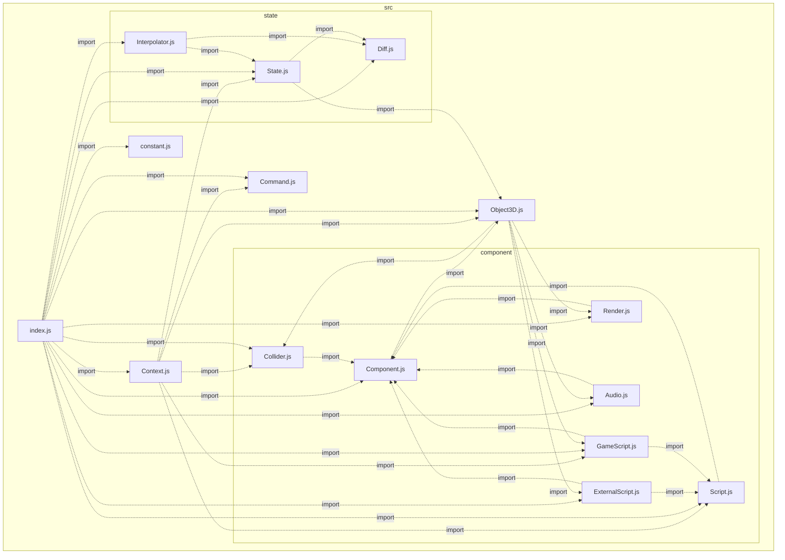

```mermaid
flowchart
 subgraph IDsrc["src"]
  IDsrcCommand2ejs["Command.js"]
  IDsrcConstant2ejs["constant.js"]
  IDsrcContext2ejs["Context.js"]
  IDsrcIndex2ejs["index.js"]
  IDsrcObject3D2ejs["Object3D.js"]
  subgraph IDsrcComponent["component"]
   IDsrcComponentAudio2ejs["Audio.js"]
   IDsrcComponentCollider2ejs["Collider.js"]
   IDsrcComponentComponent2ejs["Component.js"]
   IDsrcComponentExternalScript2ejs["ExternalScript.js"]
   IDsrcComponentGameScript2ejs["GameScript.js"]
   IDsrcComponentRender2ejs["Render.js"]
   IDsrcComponentScript2ejs["Script.js"]
  end
  subgraph IDsrcState["state"]
   IDsrcStateDiff2ejs["Diff.js"]
   IDsrcStateInterpolator2ejs["Interpolator.js"]
   IDsrcStateState2ejs["State.js"]
  end
 end
IDsrcContext2ejs-.->|import|IDsrcComponentCollider2ejs
IDsrcContext2ejs-.->|import|IDsrcComponentScript2ejs
IDsrcContext2ejs-.->|import|IDsrcComponentGameScript2ejs
IDsrcContext2ejs-.->|import|IDsrcObject3D2ejs
IDsrcContext2ejs-.->|import|IDsrcStateState2ejs
IDsrcContext2ejs-.->|import|IDsrcCommand2ejs
IDsrcIndex2ejs-.->|import|IDsrcConstant2ejs
IDsrcIndex2ejs-.->|import|IDsrcCommand2ejs
IDsrcIndex2ejs-.->|import|IDsrcContext2ejs
IDsrcIndex2ejs-.->|import|IDsrcObject3D2ejs
IDsrcIndex2ejs-.->|import|IDsrcStateInterpolator2ejs
IDsrcIndex2ejs-.->|import|IDsrcStateState2ejs
IDsrcIndex2ejs-.->|import|IDsrcStateDiff2ejs
IDsrcIndex2ejs-.->|import|IDsrcComponentRender2ejs
IDsrcIndex2ejs-.->|import|IDsrcComponentCollider2ejs
IDsrcIndex2ejs-.->|import|IDsrcComponentAudio2ejs
IDsrcIndex2ejs-.->|import|IDsrcComponentExternalScript2ejs
IDsrcIndex2ejs-.->|import|IDsrcComponentGameScript2ejs
IDsrcIndex2ejs-.->|import|IDsrcComponentScript2ejs
IDsrcIndex2ejs-.->|import|IDsrcComponentComponent2ejs
IDsrcObject3D2ejs-.->|import|IDsrcComponentExternalScript2ejs
IDsrcObject3D2ejs-.->|import|IDsrcComponentGameScript2ejs
IDsrcObject3D2ejs-.->|import|IDsrcComponentCollider2ejs
IDsrcObject3D2ejs-.->|import|IDsrcComponentAudio2ejs
IDsrcObject3D2ejs-.->|import|IDsrcComponentRender2ejs
IDsrcComponentAudio2ejs-.->|import|IDsrcComponentComponent2ejs
IDsrcComponentCollider2ejs-.->|import|IDsrcComponentComponent2ejs
IDsrcComponentComponent2ejs-.->|import|IDsrcObject3D2ejs
IDsrcComponentExternalScript2ejs-.->|import|IDsrcComponentComponent2ejs
IDsrcComponentExternalScript2ejs-.->|import|IDsrcComponentScript2ejs
IDsrcComponentGameScript2ejs-.->|import|IDsrcComponentComponent2ejs
IDsrcComponentGameScript2ejs-.->|import|IDsrcComponentScript2ejs
IDsrcComponentRender2ejs-.->|import|IDsrcComponentComponent2ejs
IDsrcComponentScript2ejs-.->|import|IDsrcComponentComponent2ejs
IDsrcStateInterpolator2ejs-.->|import|IDsrcStateState2ejs
IDsrcStateInterpolator2ejs-.->|import|IDsrcStateDiff2ejs
IDsrcStateState2ejs-.->|import|IDsrcStateDiff2ejs
IDsrcStateState2ejs-.->|import|IDsrcObject3D2ejs
```