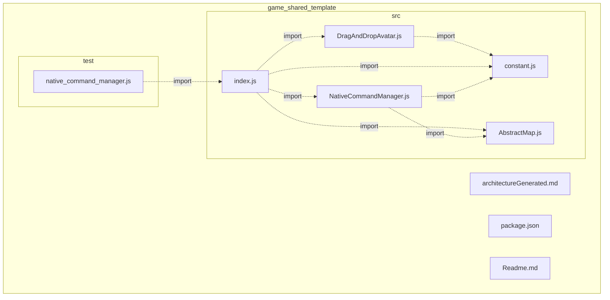

```mermaid
flowchart
 subgraph IDgame5fshared5ftemplate["game_shared_template"]
  IDgame5fshared5ftemplateArchitectureGenerated2emd["architectureGenerated.md"]
  IDgame5fshared5ftemplatePackage2ejson["package.json"]
  IDgame5fshared5ftemplateReadme2emd["Readme.md"]
  subgraph IDgame5fshared5ftemplateSrc["src"]
   IDgame5fshared5ftemplateSrcAbstractMap2ejs["AbstractMap.js"]
   IDgame5fshared5ftemplateSrcConstant2ejs["constant.js"]
   IDgame5fshared5ftemplateSrcDragAndDropAvatar2ejs["DragAndDropAvatar.js"]
   IDgame5fshared5ftemplateSrcIndex2ejs["index.js"]
   IDgame5fshared5ftemplateSrcNativeCommandManager2ejs["NativeCommandManager.js"]
  end
  subgraph IDgame5fshared5ftemplateTest["test"]
   IDgame5fshared5ftemplateTestNative5fcommand5fmanager2ejs["native_command_manager.js"]
  end
 end
IDgame5fshared5ftemplateSrcDragAndDropAvatar2ejs-.->|import|IDgame5fshared5ftemplateSrcConstant2ejs
IDgame5fshared5ftemplateSrcIndex2ejs-.->|import|IDgame5fshared5ftemplateSrcConstant2ejs
IDgame5fshared5ftemplateSrcIndex2ejs-.->|import|IDgame5fshared5ftemplateSrcDragAndDropAvatar2ejs
IDgame5fshared5ftemplateSrcIndex2ejs-.->|import|IDgame5fshared5ftemplateSrcNativeCommandManager2ejs
IDgame5fshared5ftemplateSrcIndex2ejs-.->|import|IDgame5fshared5ftemplateSrcAbstractMap2ejs
IDgame5fshared5ftemplateSrcNativeCommandManager2ejs-.->|import|IDgame5fshared5ftemplateSrcAbstractMap2ejs
IDgame5fshared5ftemplateSrcNativeCommandManager2ejs-.->|import|IDgame5fshared5ftemplateSrcConstant2ejs
IDgame5fshared5ftemplateTestNative5fcommand5fmanager2ejs-.->|import|IDgame5fshared5ftemplateSrcIndex2ejs
```