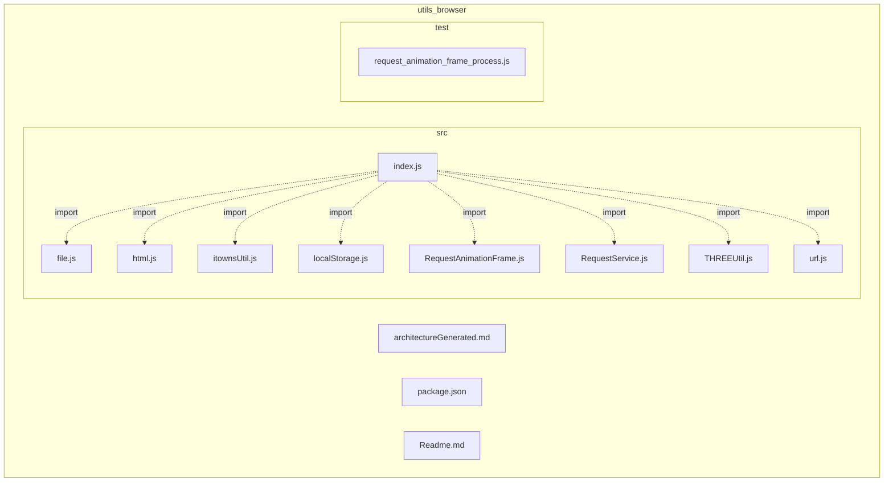

```mermaid
flowchart
 subgraph IDutils5fbrowser["utils_browser"]
  IDutils5fbrowserArchitectureGenerated2emd["architectureGenerated.md"]
  IDutils5fbrowserPackage2ejson["package.json"]
  IDutils5fbrowserReadme2emd["Readme.md"]
  subgraph IDutils5fbrowserSrc["src"]
   IDutils5fbrowserSrcFile2ejs["file.js"]
   IDutils5fbrowserSrcHtml2ejs["html.js"]
   IDutils5fbrowserSrcIndex2ejs["index.js"]
   IDutils5fbrowserSrcItownsUtil2ejs["itownsUtil.js"]
   IDutils5fbrowserSrcLocalStorage2ejs["localStorage.js"]
   IDutils5fbrowserSrcRequestAnimationFrame2ejs["RequestAnimationFrame.js"]
   IDutils5fbrowserSrcRequestService2ejs["RequestService.js"]
   IDutils5fbrowserSrcTHREEUtil2ejs["THREEUtil.js"]
   IDutils5fbrowserSrcUrl2ejs["url.js"]
  end
  subgraph IDutils5fbrowserTest["test"]
   IDutils5fbrowserTestRequest5fanimation5fframe5fprocess2ejs["request_animation_frame_process.js"]
  end
 end
IDutils5fbrowserSrcIndex2ejs-.->|import|IDutils5fbrowserSrcFile2ejs
IDutils5fbrowserSrcIndex2ejs-.->|import|IDutils5fbrowserSrcHtml2ejs
IDutils5fbrowserSrcIndex2ejs-.->|import|IDutils5fbrowserSrcItownsUtil2ejs
IDutils5fbrowserSrcIndex2ejs-.->|import|IDutils5fbrowserSrcLocalStorage2ejs
IDutils5fbrowserSrcIndex2ejs-.->|import|IDutils5fbrowserSrcRequestAnimationFrame2ejs
IDutils5fbrowserSrcIndex2ejs-.->|import|IDutils5fbrowserSrcRequestService2ejs
IDutils5fbrowserSrcIndex2ejs-.->|import|IDutils5fbrowserSrcTHREEUtil2ejs
IDutils5fbrowserSrcIndex2ejs-.->|import|IDutils5fbrowserSrcUrl2ejs
```