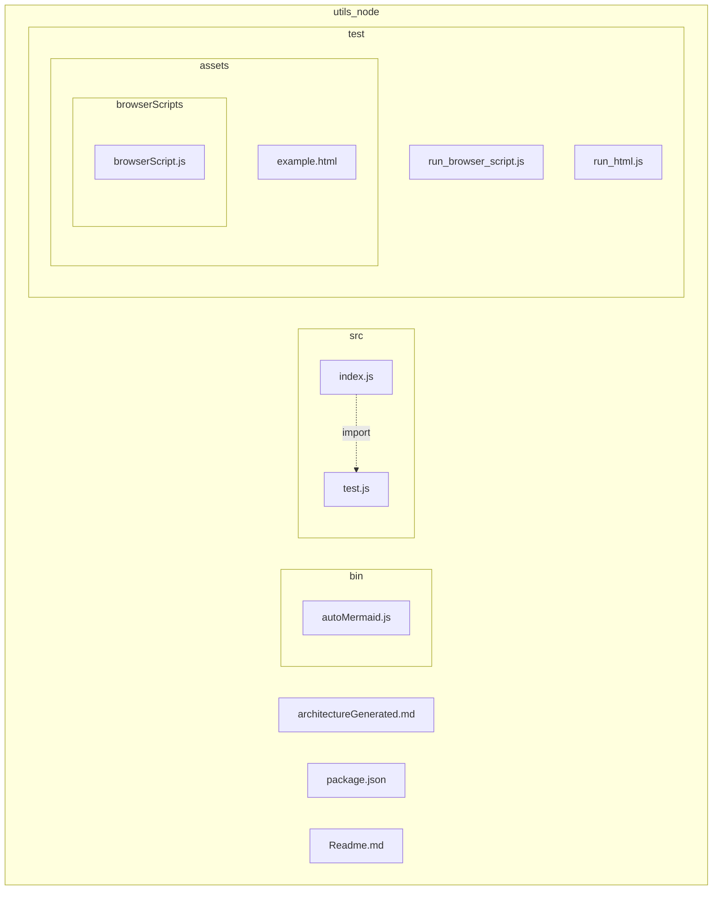

```mermaid
flowchart
 subgraph IDutils5fnode["utils_node"]
  IDutils5fnodeArchitectureGenerated2emd["architectureGenerated.md"]
  IDutils5fnodePackage2ejson["package.json"]
  IDutils5fnodeReadme2emd["Readme.md"]
  subgraph IDutils5fnodeBin["bin"]
   IDutils5fnodeBinAutoMermaid2ejs["autoMermaid.js"]
  end
  subgraph IDutils5fnodeSrc["src"]
   IDutils5fnodeSrcIndex2ejs["index.js"]
   IDutils5fnodeSrcTest2ejs["test.js"]
  end
  subgraph IDutils5fnodeTest["test"]
   IDutils5fnodeTestRun5fbrowser5fscript2ejs["run_browser_script.js"]
   IDutils5fnodeTestRun5fhtml2ejs["run_html.js"]
   subgraph IDutils5fnodeTestAssets["assets"]
    IDutils5fnodeTestAssetsExample2ehtml["example.html"]
    subgraph IDutils5fnodeTestAssetsBrowserScripts["browserScripts"]
     IDutils5fnodeTestAssetsBrowserScriptsBrowserScript2ejs["browserScript.js"]
    end
   end
  end
 end
IDutils5fnodeSrcIndex2ejs-.->|import|IDutils5fnodeSrcTest2ejs
```