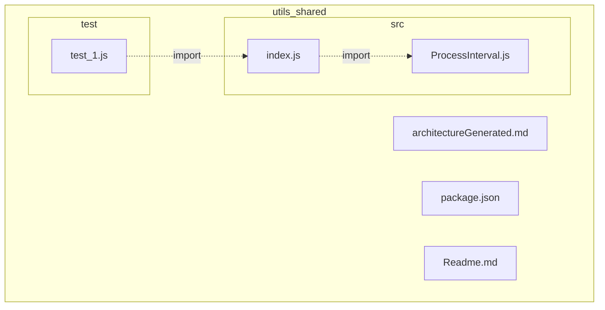

```mermaid
flowchart
 subgraph IDutils5fshared["utils_shared"]
  IDutils5fsharedArchitectureGenerated2emd["architectureGenerated.md"]
  IDutils5fsharedPackage2ejson["package.json"]
  IDutils5fsharedReadme2emd["Readme.md"]
  subgraph IDutils5fsharedSrc["src"]
   IDutils5fsharedSrcIndex2ejs["index.js"]
   IDutils5fsharedSrcProcessInterval2ejs["ProcessInterval.js"]
  end
  subgraph IDutils5fsharedTest["test"]
   IDutils5fsharedTestTest5f12ejs["test_1.js"]
  end
 end
IDutils5fsharedSrcIndex2ejs-.->|import|IDutils5fsharedSrcProcessInterval2ejs
IDutils5fsharedTestTest5f12ejs-.->|import|IDutils5fsharedSrcIndex2ejs
```