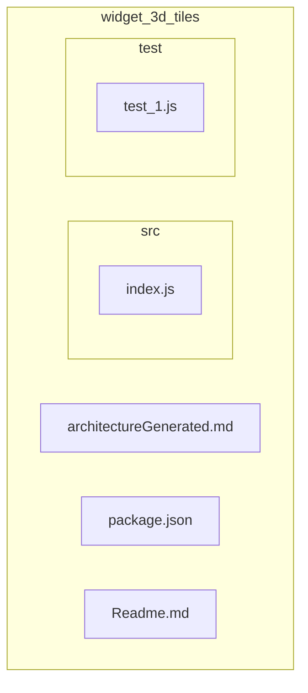

```mermaid
flowchart
 subgraph IDwidget5f3d5ftiles["widget_3d_tiles"]
  IDwidget5f3d5ftilesArchitectureGenerated2emd["architectureGenerated.md"]
  IDwidget5f3d5ftilesPackage2ejson["package.json"]
  IDwidget5f3d5ftilesReadme2emd["Readme.md"]
  subgraph IDwidget5f3d5ftilesSrc["src"]
   IDwidget5f3d5ftilesSrcIndex2ejs["index.js"]
  end
  subgraph IDwidget5f3d5ftilesTest["test"]
   IDwidget5f3d5ftilesTestTest5f12ejs["test_1.js"]
  end
 end
```