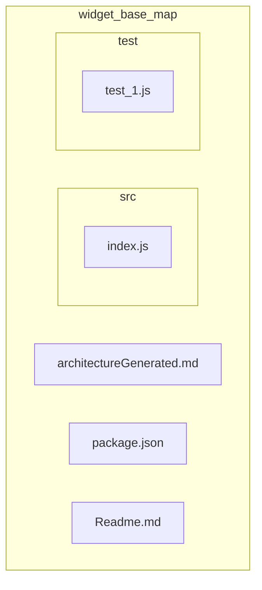

```mermaid
flowchart
 subgraph IDwidget5fbase5fmap["widget_base_map"]
  IDwidget5fbase5fmapArchitectureGenerated2emd["architectureGenerated.md"]
  IDwidget5fbase5fmapPackage2ejson["package.json"]
  IDwidget5fbase5fmapReadme2emd["Readme.md"]
  subgraph IDwidget5fbase5fmapSrc["src"]
   IDwidget5fbase5fmapSrcIndex2ejs["index.js"]
  end
  subgraph IDwidget5fbase5fmapTest["test"]
   IDwidget5fbase5fmapTestTest5f12ejs["test_1.js"]
  end
 end
```