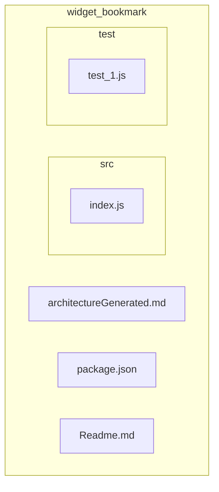

```mermaid
flowchart
 subgraph IDwidget5fbookmark["widget_bookmark"]
  IDwidget5fbookmarkArchitectureGenerated2emd["architectureGenerated.md"]
  IDwidget5fbookmarkPackage2ejson["package.json"]
  IDwidget5fbookmarkReadme2emd["Readme.md"]
  subgraph IDwidget5fbookmarkSrc["src"]
   IDwidget5fbookmarkSrcIndex2ejs["index.js"]
  end
  subgraph IDwidget5fbookmarkTest["test"]
   IDwidget5fbookmarkTestTest5f12ejs["test_1.js"]
  end
 end
```