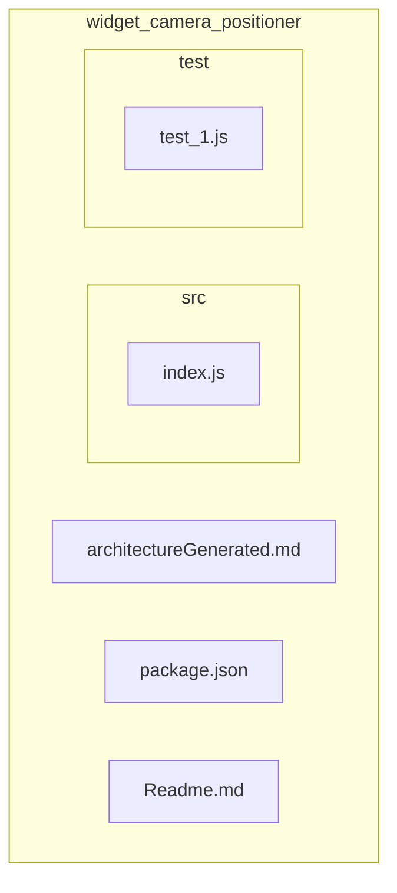

```mermaid
flowchart
 subgraph IDwidget5fcamera5fpositioner["widget_camera_positioner"]
  IDwidget5fcamera5fpositionerArchitectureGenerated2emd["architectureGenerated.md"]
  IDwidget5fcamera5fpositionerPackage2ejson["package.json"]
  IDwidget5fcamera5fpositionerReadme2emd["Readme.md"]
  subgraph IDwidget5fcamera5fpositionerSrc["src"]
   IDwidget5fcamera5fpositionerSrcIndex2ejs["index.js"]
  end
  subgraph IDwidget5fcamera5fpositionerTest["test"]
   IDwidget5fcamera5fpositionerTestTest5f12ejs["test_1.js"]
  end
 end
```