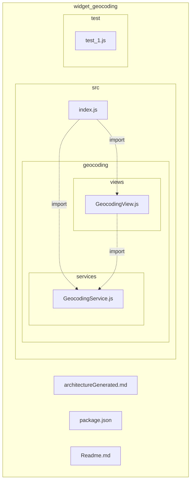

```mermaid
flowchart
 subgraph IDwidget5fgeocoding["widget_geocoding"]
  IDwidget5fgeocodingArchitectureGenerated2emd["architectureGenerated.md"]
  IDwidget5fgeocodingPackage2ejson["package.json"]
  IDwidget5fgeocodingReadme2emd["Readme.md"]
  subgraph IDwidget5fgeocodingSrc["src"]
   IDwidget5fgeocodingSrcIndex2ejs["index.js"]
   subgraph IDwidget5fgeocodingSrcGeocoding["geocoding"]
    subgraph IDwidget5fgeocodingSrcGeocodingServices["services"]
     IDwidget5fgeocodingSrcGeocodingServicesGeocodingService2ejs["GeocodingService.js"]
    end
    subgraph IDwidget5fgeocodingSrcGeocodingViews["views"]
     IDwidget5fgeocodingSrcGeocodingViewsGeocodingView2ejs["GeocodingView.js"]
    end
   end
  end
  subgraph IDwidget5fgeocodingTest["test"]
   IDwidget5fgeocodingTestTest5f12ejs["test_1.js"]
  end
 end
IDwidget5fgeocodingSrcIndex2ejs-.->|import|IDwidget5fgeocodingSrcGeocodingViewsGeocodingView2ejs
IDwidget5fgeocodingSrcIndex2ejs-.->|import|IDwidget5fgeocodingSrcGeocodingServicesGeocodingService2ejs
IDwidget5fgeocodingSrcGeocodingViewsGeocodingView2ejs-.->|import|IDwidget5fgeocodingSrcGeocodingServicesGeocodingService2ejs
```