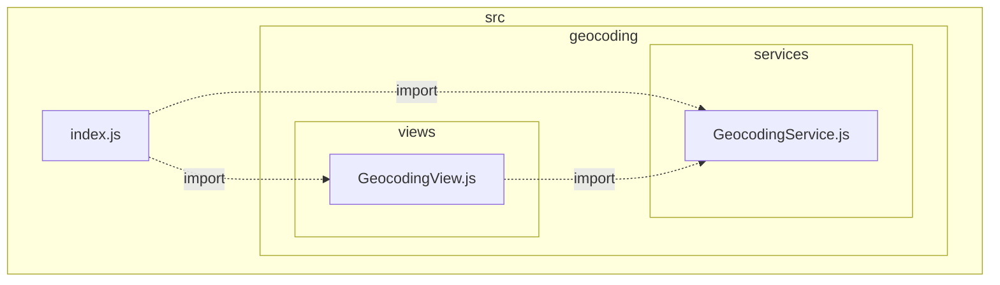

```mermaid
flowchart
 subgraph IDsrc["src"]
  IDsrcIndex2ejs["index.js"]
  subgraph IDsrcGeocoding["geocoding"]
   subgraph IDsrcGeocodingServices["services"]
    IDsrcGeocodingServicesGeocodingService2ejs["GeocodingService.js"]
   end
   subgraph IDsrcGeocodingViews["views"]
    IDsrcGeocodingViewsGeocodingView2ejs["GeocodingView.js"]
   end
  end
 end
IDsrcIndex2ejs-.->|import|IDsrcGeocodingViewsGeocodingView2ejs
IDsrcIndex2ejs-.->|import|IDsrcGeocodingServicesGeocodingService2ejs
IDsrcGeocodingViewsGeocodingView2ejs-.->|import|IDsrcGeocodingServicesGeocodingService2ejs
```