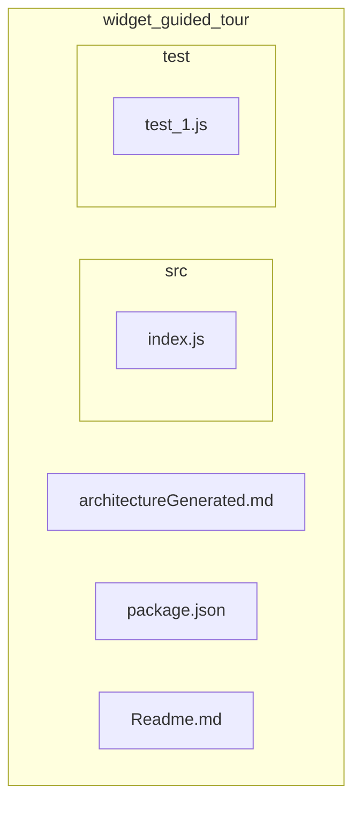

```mermaid
flowchart
 subgraph IDwidget5fguided5ftour["widget_guided_tour"]
  IDwidget5fguided5ftourArchitectureGenerated2emd["architectureGenerated.md"]
  IDwidget5fguided5ftourPackage2ejson["package.json"]
  IDwidget5fguided5ftourReadme2emd["Readme.md"]
  subgraph IDwidget5fguided5ftourSrc["src"]
   IDwidget5fguided5ftourSrcIndex2ejs["index.js"]
  end
  subgraph IDwidget5fguided5ftourTest["test"]
   IDwidget5fguided5ftourTestTest5f12ejs["test_1.js"]
  end
 end
```