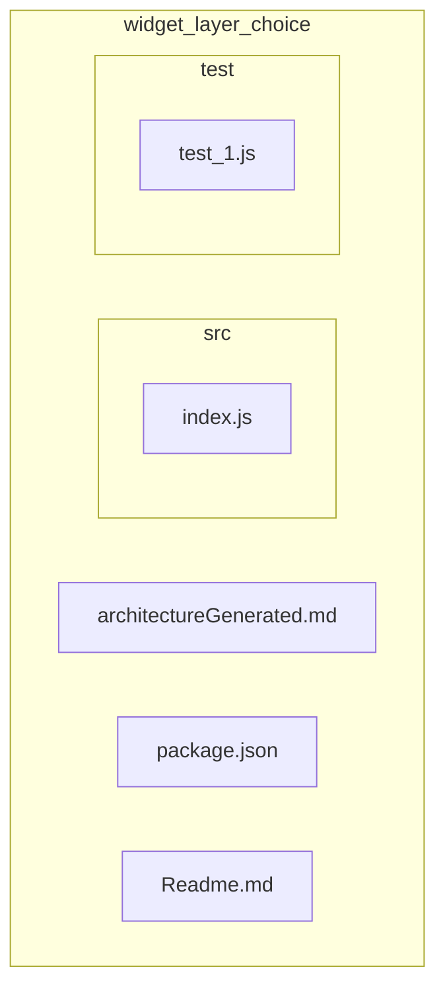

```mermaid
flowchart
 subgraph IDwidget5flayer5fchoice["widget_layer_choice"]
  IDwidget5flayer5fchoiceArchitectureGenerated2emd["architectureGenerated.md"]
  IDwidget5flayer5fchoicePackage2ejson["package.json"]
  IDwidget5flayer5fchoiceReadme2emd["Readme.md"]
  subgraph IDwidget5flayer5fchoiceSrc["src"]
   IDwidget5flayer5fchoiceSrcIndex2ejs["index.js"]
  end
  subgraph IDwidget5flayer5fchoiceTest["test"]
   IDwidget5flayer5fchoiceTestTest5f12ejs["test_1.js"]
  end
 end
```