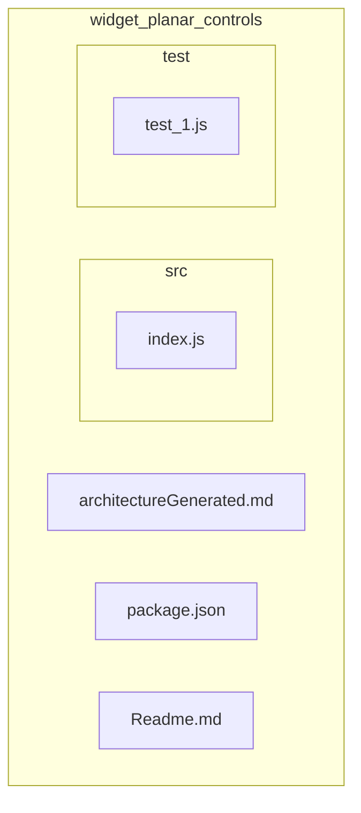

```mermaid
flowchart
 subgraph IDwidget5fplanar5fcontrols["widget_planar_controls"]
  IDwidget5fplanar5fcontrolsArchitectureGenerated2emd["architectureGenerated.md"]
  IDwidget5fplanar5fcontrolsPackage2ejson["package.json"]
  IDwidget5fplanar5fcontrolsReadme2emd["Readme.md"]
  subgraph IDwidget5fplanar5fcontrolsSrc["src"]
   IDwidget5fplanar5fcontrolsSrcIndex2ejs["index.js"]
  end
  subgraph IDwidget5fplanar5fcontrolsTest["test"]
   IDwidget5fplanar5fcontrolsTestTest5f12ejs["test_1.js"]
  end
 end
```