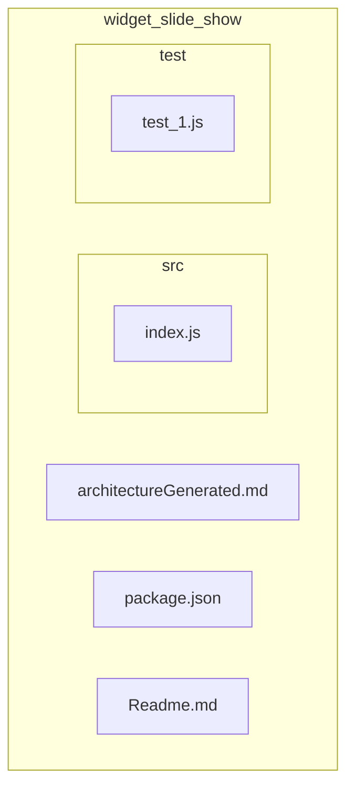

```mermaid
flowchart
 subgraph IDwidget5fslide5fshow["widget_slide_show"]
  IDwidget5fslide5fshowArchitectureGenerated2emd["architectureGenerated.md"]
  IDwidget5fslide5fshowPackage2ejson["package.json"]
  IDwidget5fslide5fshowReadme2emd["Readme.md"]
  subgraph IDwidget5fslide5fshowSrc["src"]
   IDwidget5fslide5fshowSrcIndex2ejs["index.js"]
  end
  subgraph IDwidget5fslide5fshowTest["test"]
   IDwidget5fslide5fshowTestTest5f12ejs["test_1.js"]
  end
 end
```