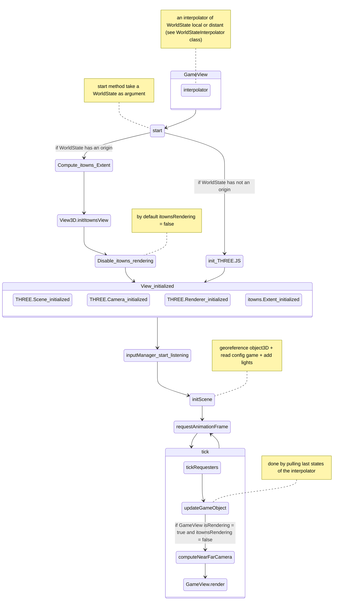
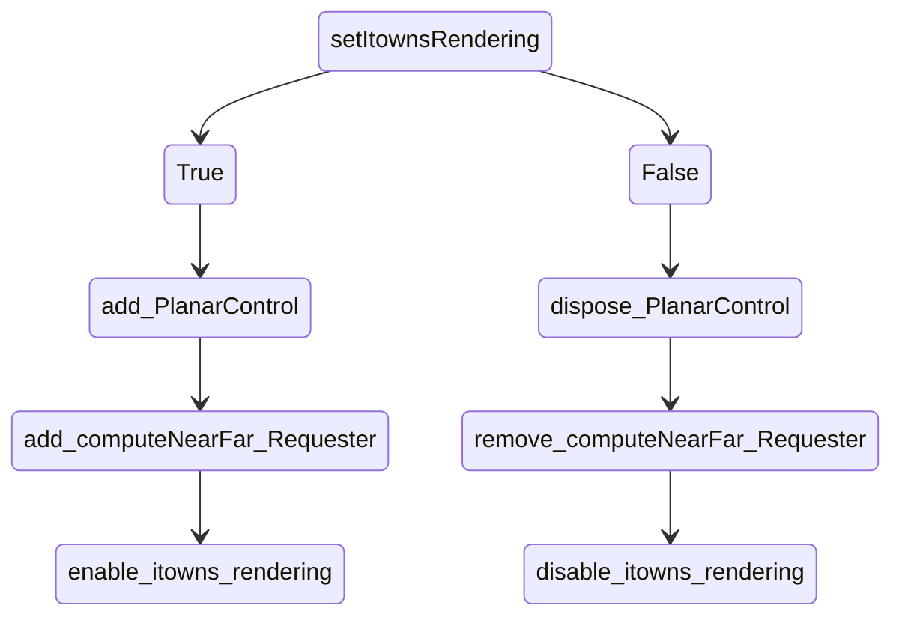

# GameView

This document explains how works the refresh pass of the GameView class.

Below this is what happen when you start a GameView:



Note you can switch from GameView rendering to the itowns rendering pass using ```GameView.setItownsRendering``` method.


