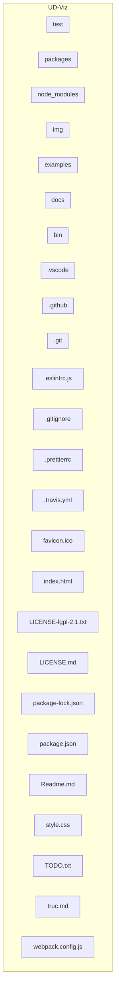

```mermaid
flowchart
 subgraph IDUD2dViz["UD-Viz"]
  IDUD2dViz2eeslintrc2ejs[".eslintrc.js"]
  IDUD2dViz2egitignore[".gitignore"]
  IDUD2dViz2eprettierrc[".prettierrc"]
  IDUD2dViz2etravis2eyml[".travis.yml"]
  IDUD2dVizFavicon2eico["favicon.ico"]
  IDUD2dVizIndex2ehtml["index.html"]
  IDUD2dVizLICENSE2dlgpl2d22e12etxt["LICENSE-lgpl-2.1.txt"]
  IDUD2dVizLICENSE2emd["LICENSE.md"]
  IDUD2dVizPackage2dlock2ejson["package-lock.json"]
  IDUD2dVizPackage2ejson["package.json"]
  IDUD2dVizReadme2emd["Readme.md"]
  IDUD2dVizStyle2ecss["style.css"]
  IDUD2dVizTODO2etxt["TODO.txt"]
  IDUD2dVizTruc2emd["truc.md"]
  IDUD2dVizWebpack2econfig2ejs["webpack.config.js"]
  subgraph IDUD2dViz2egit[".git"]
  end
  subgraph IDUD2dViz2egithub[".github"]
  end
  subgraph IDUD2dViz2evscode[".vscode"]
  end
  subgraph IDUD2dVizBin["bin"]
  end
  subgraph IDUD2dVizDocs["docs"]
  end
  subgraph IDUD2dVizExamples["examples"]
  end
  subgraph IDUD2dVizImg["img"]
  end
  subgraph IDUD2dVizNode5fmodules["node_modules"]
  end
  subgraph IDUD2dVizPackages["packages"]
  end
  subgraph IDUD2dVizTest["test"]
  end
 end
```